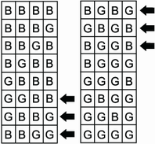

本节涵盖

- 概率论的基础是什么 ?
- 计算单个观察的概率 ?
- 计算一系列观察的概率 ?

生活中很少有事情是确定的；大多数事情都是偶然的。每当我们为我们最喜欢的运动队加油，或购买彩票，或投资股市时，我们都希望得到某种特定的结果，但这种结果永远无法保证。随机性渗透到我们的日常体验中。幸运的是，这种随机性仍然可以减轻和控制。我们知道，一些不可预测的事件比其他事件发生得更少，并且某些决策的不确定性比其他风险更大的选择要小。开车上班比骑摩托车更安全。将你的部分储蓄投资于退休账户比将其全部押在 21 点牌上更安全。我们可以从本质上确定地感觉到这些权衡，因为即使是最不可预测的系统仍然会表现出一些可预测的行为。这些行为已经使用概率论进行了严格的研究。概率论是数学的一个内在复杂的分支。然而，在不了解数学基础的情况下也可以理解该理论的各个方面。事实上，不需要知道一个数学方程就可以在 Python 中解决困难的概率问题。这种无方程的概率方法需要对数学家所说的样本空间有一个基本的了解。

## 1.1 样本空间分析：测量结果不确定性的无方程方法

某些行动具有可衡量的结果。样本空间是一个动作可能产生的所有可能结果的集合。让我们采取抛硬币的简单动作。硬币将落在正面或反面。因此，抛硬币会产生两种可衡量的结果之一：正面或反面。通过将这些结果存储在 Python 集合中，我们可以创建一个掷硬币的样本空间。

```python
sample_space = {'Heads', 'Tails'}    ❶
```

❶ 将元素存储在大括号中会创建一个 Python 集。 Python 集是唯一的无序元素的集合。

假设我们随机选择一个 sample_space 元素。 所选元素在多少时间内等于 Heads？ 好吧，我们的样本空间包含两个可能的元素。 每个元素在集合中占据相同比例的空间。 因此，我们期望以 1/2 的频率选择 Heads。 该频率被正式定义为结果的概率。 sample_space 内的所有结果共享相同的概率，等于 1 / len(sample_space)。

```python
probability_heads = 1 / len(sample_space)
print(f'Probability of choosing heads is {probability_heads}')
 
Probability of choosing heads is 0.5
```

选择正面的概率等于 0.5。这与抛硬币的动作直接相关。我们假设硬币是无偏的，这意味着硬币同样有可能出现正面或反面。因此，抛硬币在概念上等同于从 sample_space 中选择一个随机元素。因此，硬币正面朝上的概率为 0.5；它落在尾巴上的概率也等于0.5。

我们已经为我们的两个可衡量结果分配了概率。但是，我们还可以提出其他问题。硬币落在正面或反面的概率是多少？或者，更奇特的是，硬币在空中永远旋转，既不正面也不反面着陆的概率是多少？为了找到严格的答案，我们需要定义事件的概念。事件是 sample_space 中满足某些事件条件的那些元素的子集（如图 1.1 所示）。事件条件是一个简单的布尔函数，其输入是单个 sample_space 元素。只有当元素满足我们的条件约束时，该函数才返回 True。


图 1.1 应用于样本空间的四个事件条件。 样本空间包含两个结果：正面和反面。 箭头代表事件条件。 每个事件条件都是一个是或否函数。 每个函数过滤掉那些不满足其项的结果。 剩余的结果形成一个事件。 每个事件都包含在样本空间中发现的结果的一个子集。 四种事件是可能的：正面、反面、正面或反面，以及既不正面也不反面。

让我们定义两个事件条件：一个是硬币落在正面或反面，另一个是硬币既不正面也不反面。

```python
def is_heads_or_tails(outcome):  return outcome in {'Heads', 'Tails'}
def is_neither(outcome): return not is_heads_or_tails(outcome)
```

此外，为了完整起见，让我们为硬币恰好满足我们两个潜在结果之一的两个基本事件定义事件条件。

```python
def is_heads(outcome): return outcome == 'Heads'
def is_tails(outcome): return outcome == 'Tails'
```

我们可以将事件条件传递给通用的 get_matching_event 函数。该函数在清单 1.5 中定义。它的输入是事件条件和通用样本空间。该函数遍历通用样本空间并返回 event_condition(outcome) 为 True 的结果集。

```python
def get_matching_event(event_condition, sample_space):
    return set([outcome for outcome in sample_space if event_condition(outcome)])
```

让我们在四个事件条件上执行 get_matching_event。然后我们将输出四个提取的事件。

```python
event_conditions = [is_heads_or_tails, is_heads, is_tails, is_neither]
 
for event_condition in event_conditions:
    print(f"Event Condition: {event_condition.__name__}")      ❶
    event = get_matching_event(event_condition, sample_space)
    print(f'Event: {event}\n')
Event Condition: is_heads_or_tails
Event: {'Tails', 'Heads'}
 
Event Condition: is_heads
Event: {'Heads'}
 
Event Condition: is_tails
Event: {'Tails'}
 
Event Condition: is_neither
Event: set()
```

❶ 打印 event_condition 函数的名称
我们已经成功地从 sample_space 中提取了四个事件。每个事件发生的概率是多少？早些时候，我们表明公平硬币的单元素结果的概率是 1 / len(sample_space)。此属性可以概括为包括多元素事件。事件的概率等于 len(event) / len(sample_space)，但前提是已知所有结果都以相同的可能性发生。换句话说，公平硬币的多元素事件的概率等于事件大小除以样本空间大小。我们现在使用事件大小来计算四个事件概率。

```python
def compute_probability(event_condition, generic_sample_space):
    event = get_matching_event(event_condition, generic_sample_space)    ❶
    return len(event) / len(generic_sample_space)                        ❷
 
for event_condition in event_conditions:
    prob = compute_probability(event_condition, sample_space)
    name = event_condition.__name__
    print(f"Probability of event arising from '{name}' is {prob}")

Probability of event arising from 'is_heads_or_tails' is 1.0
Probability of event arising from 'is_heads' is 0.5
Probability of event arising from 'is_tails' is 0.5
Probability of event arising from 'is_neither' is 0.0
```

❶compute_probability 函数提取与输入的事件条件相关联的事件来计算其概率。
❷ 概率等于事件大小除以样本空间大小。
执行的代码输出不同范围的事件概率，最小的为 0.0，最大的为 1.0。这些值代表概率的下限和上限；任何概率都不会低于 0.0 或高于 1.0。

### 1.1.1 分析有偏见的硬币

我们计算了无偏硬币的概率。如果那枚硬币有偏见会发生什么？例如，假设一枚硬币正面着地的可能性是反面的四倍。我们如何计算未以同等方式加权的结果的可能性？好吧，我们可以构造一个由 Python 字典表示的加权样本空间。每个结果都被视为一个键，其值映射到相关的权重。在我们的示例中，Heads 的权重是 Tails 的四倍，因此我们将 Tails 映射到 1，Heads 映射到 4。

```python
weighted_sample_space = {'Heads': 4, 'Tails': 1}
```

我们的新样本空间存储在字典中。 这允许我们将样本空间的大小重新定义为所有字典权重的总和。 在 weighted_sample_ 空间内，该总和将等于 5。

```python
sample_space_size = sum(weighted_sample_space.values())
assert sample_space_size == 5
```

我们可以用类似的方式重新定义事件大小。 每个事件都是一组结果，这些结果映射到权重。 对权重求和得出事件大小。 因此，满足 is_heads_or_tails 事件条件的事件大小也是 5。

```python
event = get_matching_event(is_heads_or_tails, weighted_sample_space)    ❶
event_size = sum(weighted_sample_space[outcome] for outcome in event)
assert event_size == 5
```

❶ 提醒一下，这个函数迭代输入的样本空间中的每个结果。 因此，它将在我们的字典输入上按预期工作。 这是因为 Python 迭代字典键，而不是许多其他流行的编程语言中的键值对。
我们对样本空间大小和事件大小的广义定义允许我们创建一个计算事件概率函数。 该函数将 generic_sample_ 空间变量作为输入，该变量可以是加权字典或未加权集。

```python
def compute_event_probability(event_condition, generic_sample_space):
    event = get_matching_event(event_condition, generic_sample_space)
    if type(generic_sample_space) == type(set()):                      ❶
        return len(event) / len(generic_sample_space)
 
    event_size = sum(generic_sample_space[outcome]
                     for outcome in event)
    return event_size / sum(generic_sample_space.values())
```

❶ 检查 generic_event_space 是否是一个集合
我们现在可以输出偏置硬币的所有事件概率，而无需重新定义我们的四个事件条件函数。

```python
for event_condition in event_conditions:
    prob = compute_event_probability(event_condition, weighted_sample_space)
    name = event_condition.__name__
    print(f"Probability of event arising from '{name}' is {prob}")
 
Probability of event arising from 'is_heads' is 0.8
Probability of event arising from 'is_tails' is 0.2
Probability of event arising from 'is_heads_or_tails' is 1.0
Probability of event arising from 'is_neither' is 0.0
```

仅用几行代码，我们就构建了一个用于解决许多概率问题的工具。让我们将此工具应用于比简单抛硬币更复杂的问题。

## 1.2 计算非平凡概率

我们现在将使用 compute_event_probability 解决几个示例问题。

### 1.2.1 问题一：分析一个有四个孩子的家庭

假设一个家庭有四个孩子。恰好两个孩子是男孩的概率是多少？我们假设每个孩子生男孩或生女孩的可能性相同。因此，我们可以构建一个未加权的样本空间，其中每个结果代表一个可能的四个孩子的序列，如图 1.2 所示。




图 1.2 四个兄弟姐妹的样本空间。样本空间中的每一行包含 16 个可能结果中的 1 个。每个结果都代表了四个孩子的独特组合。每个孩子的性别用一个字母表示：B 代表男孩，G 代表女孩。两个男孩的结果用箭头标记。有六个这样的箭头；因此，两个男孩的概率等于 6 / 16。

```python
possible_children = ['Boy', 'Girl']
sample_space = set()
for child1 in possible_children:
    for child2 in possible_children:
        for child3 in possible_children:
            for child4 in possible_children:
                outcome = (child1, child2, child3, child4)    ❶
                sample_space.add(outcome)
```

❶ 每个可能的四个孩子的序列都由一个四元素元组表示。
我们运行了四个嵌套的 for 循环来探索四个出生的顺序。这不是代码的有效使用。我们可以使用 Python 的内置 itertools.product 函数更轻松地生成我们的样本空间，该函数返回所有输入列表中所有元素的所有成对组合。接下来，我们将 possible_children 列表的四个实例输入到 itertools.product 中。然后 product 函数遍历列表的所有四个实例，计算列表元素的所有组合。最终输出等于我们的样本空间。

```python
from itertools import product
all_combinations = product(*(4 * [possible_children]))     ❶
assert set(all_combinations) == sample_space               ❷
```

❶ * 运算符将存储在列表中的多个参数解包。然后将这些参数传递给指定的函数。因此，调用 product(*(4 * [possible_children])) 等效于调用 product(possible_children, possible_children, possible_children, possible_children)。
❷ 请注意，运行此行后，all_combinations 将为空。这是因为 product 返回一个 Python 迭代器，它只能迭代一次。对我们来说，这不是问题。我们将更有效地计算样本空间，并且在未来的代码中将不会使用 all_combinations。
我们可以通过执行 set(product(possible_children, repeat=4)) 使我们的代码更加高效。通常，运行 product(possible_children, repeat=n) 会返回 n 个孩子的所有可能组合的迭代。

```python
sample_space_efficient = set(product(possible_children, repeat=4))
assert sample_space == sample_space_efficient
```

让我们计算一下由有两个男孩的家庭组成的 sample_space 的比例。我们定义了一个 has_two_boys 事件条件，然后将该条件传递给 compute_event_probability。

```python
def has_two_boys(outcome): return len([child for child in outcome if child == 'Boy']) == 2
prob = compute_event_probability(has_two_boys, sample_space)
print(f"Probability of 2 boys is {prob}")
 
Probability of 2 boys is 0.375
```

在一个有四个孩子的家庭中，恰好有两个男孩出生的概率是 0.375。这意味着，我们预计 37.5% 的有四个孩子的家庭中的男孩和女孩数量相同。当然，实际观察到的有两个男孩的家庭的百分比会因随机机会而有所不同。

### 1.2.2 问题 2：分析多个模具辊

假设我们展示了一个公平的六面骰子，其面编号为 1 到 6。骰子被掷六次。这六个掷骰子加起来为 21 的概率是多少？

我们首先定义任何单个滚动的可能值。这些是范围从 1 到 6 的整数。

```python
possible_rolls = list(range(1, 7))
print(possible_rolls)
 
[1, 2, 3, 4, 5, 6]
```

接下来，我们使用 product 函数为六个连续的卷创建样本空间。

```python
sample_space = set(product(possible_rolls, repeat=6))
```

最后，我们定义了一个 has_sum_of_21 事件条件，随后将其传递给 compute_event_probability。

```python
def has_sum_of_21(outcome): return sum(outcome) == 21
 
prob = compute_event_probability(has_sum_of_21, sample_space)
print(f"6 rolls sum to 21 with a probability of {prob}")       ❶

6 rolls sum to 21 with a probability of 0.09284979423868313
```

❶ 从概念上讲，掷一个骰子六次相当于同时掷六个骰子。
超过 9% 的时间，六个掷骰子的总和为 21。请注意，我们的分析可以使用 lambda 表达式更简洁地编码。 Lambda 表达式是不需要名称的单行匿名函数。在本书中，我们使用 lambda 表达式将短函数传递给其他函数。

```python
prob = compute_event_probability(lambda x: sum(x) == 21, sample_space)   ❶
assert prob == compute_event_probability(has_sum_of_21, sample_space)
```

❶ Lambda 表达式允许我们在一行代码中定义短函数。编码 lambda x: 在功能上等同于编码 func(x):。因此，lambda x: sum(x) == 21 在功能上等同于 has_sum_of_21。

### 1.2.3 问题 3：使用加权样本空间计算骰子概率

我们刚刚计算了 6 个掷骰子总和为 21 的可能性。现在，让我们使用加权样本空间重新计算该概率。我们需要将我们的未加权样本空间集转换为一个加权样本空间字典；这将要求我们确定所有可能的骰子总和。然后我们必须计算每个总和在所有可能的骰子组合中出现的次数。这些组合已经存储在我们计算出的 sample_space 集中。通过将骰子总和映射到它们的出现次数，我们将产生一个 weighted_sample_space 结果。

```python
from collections import defaultdict        ❶
weighted_sample_space = defaultdict(int)   ❷
for outcome in sample_space:               ❸
    total = sum(outcome)                   ❹
    weighted_sample_space[total] += 1      ❺
```

❶ 该模块返回字典，其键都被赋予了默认值。例如， defaultdict(int) 返回一个字典，其中每个键的默认值都设置为零。
❷ weighted_sample 字典将每个相加的六骰子组合映射到其出现次数。
❸ 每个结果都包含六个骰子的独特组合。
❹ 计算六个独特的模具辊的总和
❺ 更新总骰子值的出现次数
在重新计算概率之前，让我们简要探讨一下 weighted_sample_space 的属性。并非样本空间中的所有权重都相等——有些权重比其他权重小得多。例如，只有一种方法可以让掷骰子的总和为 6：我们必须精确地掷出六个 1 才能实现骰子和的组合。因此，我们期望 weighted_sample_space[6] 等于 1。我们期望 weighted_sample_space[36] 也等于 1，因为我们必须滚动六个 6 才能达到 36 的总和。

```python
assert weighted_sample_space[6] == 1
assert weighted_sample_space[36] == 1
```

同时，weighted_sample_space[21] 的值明显更高。

```python
num_combinations = weighted_sample_space[21]
print(f"There are {num_combinations } ways for 6 die rolls to sum to 21")
 
There are 4332 ways for 6 die rolls to sum to 21
```

如输出所示，有 4,332 种方式使 6 个骰子掷出的总和为 21。例如，我们可以掷出四个 4，然后是 3，然后是 2。或者我们可以掷三个 4，然后是 5、3，和 1. 数以千计的其他组合是可能的。这就是为什么 21 之和比 6 之和更有可能的原因。

```python
assert sum([4, 4, 4, 4, 3, 2]) == 21
assert sum([4, 4, 4, 5, 3, 1]) == 21
```

请注意，观察到的 4,332 计数等于未加权事件的长度，其掷骰子总数为 21。此外，weighted_sample 中的值的总和等于 sample_space 的长度。因此，未加权和加权事件概率计算之间存在直接联系。

```python
event = get_matching_event(lambda x: sum(x) == 21, sample_space)
assert weighted_sample_space[21] == len(event)
assert sum(weighted_sample_space.values()) == len(sample_space)
```

现在让我们使用 weighted_sample_space 字典重新计算概率。最终掷出 21 的概率应该保持不变。

```python
prob = compute_event_probability(lambda x: x == 21,
                                 weighted_sample_space)
assert prob == compute_event_probability(has_sum_of_21, sample_space)
print(f"6 rolls sum to 21 with a probability of {prob}")
 
6 rolls sum to 21 with a probability of 0.09284979423868313
```

使用加权样本空间比使用未加权样本空间有什么好处？更少的内存使用！正如我们接下来看到的，未加权的样本空间集的元素数量是加权样本空间字典的 150 倍。

```python
print('Number of Elements in Unweighted Sample Space:')
print(len(sample_space))
print('Number of Elements in Weighted Sample Space:')
print(len(weighted_sample_space))
Number of Elements in Unweighted Sample Space:
46656
Number of Elements in Weighted Sample Space:
31
```

## 1.3 计算区间范围内的概率
到目前为止，我们只分析了满足某个单一值的事件条件。现在我们将分析跨越值区间的事件条件。区间是两个边界截止点之间（包括两个边界点）的所有数字的集合。让我们定义一个 is_in_interval 函数来检查一个数字是否在指定的区间内。我们将通过传递一个最小值和一个最大值参数来控制区间边界。

```python
def is_in_interval(number, minimum, maximum):
    return minimum <= number <= maximum          ❶
```

❶ 定义一个包含最小/最大边界的封闭区间。但是，也可以在需要时定义开区间。在开放区间中，至少有一个边界被排除在外。
给定 is_in_interval 函数，我们可以计算事件的关联值落在某个数值范围内的概率。例如，让我们计算我们连续六次掷骰子总和为 10 到 21（含）之间的值的可能性。

```python
prob = compute_event_probability(
    lambda x: is_in_interval(x, 10, 21),	❶
    weighted_sample_space
)
print(f"Probability of interval is {prob}")
 
Probability of interval is 0.5446244855967078
```

❶ Lambda 函数，它接受一些输入 x，如果 x 落在 10 到 21 之间的区间内，则返回 True。这个单行 lambda 函数用作我们的事件条件。
超过 54% 的时间，六个掷骰子将落入该间隔范围内。因此，如果出现 13 或 20 的滚动总和，我们不应该感到惊讶。

### 1.3.1 使用区间分析评估极值

区间分析对于解决概率和统计中的一整类非常重要的问题至关重要。其中一个问题涉及对极端情况的评估：问题归结为观察到的数据是否过于极端而令人难以置信。

当随机发生太不寻常时，数据似乎是极端的。例如，假设我们观察了 10 次据称公平的硬币翻转，并且该硬币 10 次中有 8 次正面朝上。对于一枚公平的硬币来说，这是一个合理的结果吗？还是我们的硬币暗中偏向于正面着陆？为了找出答案，我们必须回答以下问题：10 次公平的硬币翻转导致极端数量的正面朝上的概率是多少？我们将极端人数定义为八个或更多。因此，我们可以将问题描述如下：10 次公平的硬币翻转产生 8 到 10 个正面的概率是多少？

我们将通过计算区间概率来找到答案。然而，首先我们需要每个可能的 10 个翻转硬币序列的样本空间。让我们生成一个加权样本空间。如前所述，这比使用非加权表示更有效。

以下代码创建了一个 weighted_sample_space 字典。它的键等于可观察头部的总数，范围从 0 到 10。这些头部计数映射到值。每个值保存包含相关联的人头数的硬币翻转组合的数量。因此，我们期望 weighted_sample_space[10] 等于 1，因为只有一种可能的方法可以将硬币抛 10 次并得到 10 次正面。同时，我们预计 weighted_sample_space[9] 等于 10，因为 9 个头中的单个尾部可能出现在 10 个不同的位置。

```python
def generate_coin_sample_space(num_flips=10):                         ❶
    weighted_sample_space = defaultdict(int)
    for coin_flips in product(['Heads', 'Tails'], repeat=num_flips):
        heads_count = len([outcome for outcome in coin_flips          ❷
                          if outcome == 'Heads'])
        weighted_sample_space[heads_count] += 1
 
    return weighted_sample_space
 
weighted_sample_space = generate_coin_sample_space()
assert weighted_sample_space[10] == 1
assert weighted_sample_space[9] == 1
```

❶ 为了可重用性，我们定义了一个通用函数，该函数返回 num_flips 抛硬币的加权样本空间。 num_flips 参数预设为 10 次硬币翻转。
❷ num_flips 硬币翻转的唯一序列中正面的数量
我们的加权样本空间已准备就绪。我们现在计算观察到 8 到 10 个正面的间隔的概率。

```python
prob = compute_event_probability(
    lambda x: is_in_interval(x, 8, 10),
    weighted_sample_space
)
print(f"Probability of observing more than 7 heads is {prob}")

Probability of observing more than 7 heads is 0.0546875
```

大约 5% 的时间，十次公平的硬币翻转产生超过七个正面。我们观察到的人数并不常见。这是否意味着硬币有偏见？不必要。我们还没有考虑过极端的尾部计数。如果我们观察到八个反面而不是八个正面，我们仍然会对硬币持怀疑态度。我们计算的区间没有考虑到这种极端情况——相反，我们将八个或更多的尾巴视为另一种正常的可能性。为了评估我们硬币的公平性，我们必须包括观察到八个或更多尾巴的可能性。这相当于观察两个或更少的头。

让我们将问题表述如下：10 次公平的硬币翻转产生 0 到 2 次正面或 8 到 10 次正面的概率是多少？或者，更简洁地说，抛硬币不产生 3 到 7 个正面的概率是多少？此处计算该概率。

```python
prob = compute_event_probability(
    lambda x: not is_in_interval(x, 3, 7),
    weighted_sample_space
)
print(f"Probability of observing more than 7 heads or 7 tails is {prob}")

Probability of observing more than 7 heads or 7 tails is 0.109375
```

大约 10% 的时间，十次公平的硬币翻转产生至少八个相同的结果。这种可能性很小，但仍在合理范围内。没有额外的证据，很难确定代币是否真的有偏见。所以，让我们收集这些证据。假设我们再抛硬币 10 次，又出现 8 个正面。这使我们总共掷硬币 20 次中有 16 次正面朝上。我们对硬币公平性的信心减少了，但减少了多少？我们可以通过测量概率的变化来找出。让我们找出 20 次公平的硬币翻转不会产生 5 到 15 个正面的概率。

```python
weighted_sample_space_20_flips = generate_coin_sample_space(num_flips=20)
prob = compute_event_probability(
    lambda x: not is_in_interval(x, 5, 15),
    weighted_sample_space_20_flips
)
print(f"Probability of observing more than 15 heads or 15 tails is {prob}")

Probability of observing more than 15 heads or 15 tails is 0.01181793212890625
```

更新后的概率从大约 0.1 下降到大约 0.01。因此，增加的证据导致我们对硬币公平性的信心下降了十倍。尽管概率下降，正面与反面的比率仍保持在 4 比 1 不变。我们最初和更新的实验都产生了 80% 的正面和 20% 的反面。这就引出了一个有趣的问题：为什么随着硬币翻转的次数增多，观察到极端结果的概率会降低？我们可以通过详细的数学分析找出来。然而，一个更直观的解决方案是将我们两个样本空间字典中的人头计数分布可视化。可视化实际上是每个字典中存在的键（人头计数）与值（组合计数）的关系图。我们可以使用 Python 最流行的可视化库 Matplotlib 执行此绘图。在随后的部分中，我们将讨论 Matplotlib 的用法及其在概率论中的应用。

## 概括

- 样本空间是一个动作可以产生的所有可能结果的集合。
- 事件是样本空间的子集，仅包含满足某些事件条件的那些结果。事件条件是一个布尔函数，它将结果作为输入并返回 True 或 False。
- 事件发生的概率等于事件结果占整个样本空间中所有可能结果的比例。
- 可以在数字区间内计算概率。区间被定义为夹在两个边界值之间的所有数字的集合。
- 区间概率可用于确定观察是否出现极端情况。