本节涵盖

- 使用 Matplotlib 创建简单图
- 标记绘制的数据
- 什么是概率分布？
- 绘制和比较多个概率分布

数据图是任何数据科学家武器库中最有价值的工具之一。如果没有良好的可视化效果，我们从数据中收集洞察力的能力就会被削弱。幸运的是，我们可以使用外部 Python Matplotlib 库，该库针对输出高质量绘图和数据可视化进行了全面优化。在本节中，我们使用 Matplotlib 来更好地理解我们在第 1 节中计算的抛硬币概率。

## 2.1 基本的 Matplotlib 绘图

让我们从安装 Matplotlib 库开始。

注意 从命令行终端调用 pip install matplotlib 来安装 Matplotlib 库。

安装完成后，导入 matplotlib.pyplot，这是库的主要绘图生成模块。按照惯例，模块通常使用缩短的别名 plt 导入。

```python
import matplotlib.pyplot as plt
```

我们现在将使用 plt.plot 绘制一些数据。该方法将两个可迭代对象作为输入：x 和 y。调用 plt.plot(x, y) 准备 x 与 y 的二维图；显示绘图需要随后调用 plt.show()。让我们将 x 分配给 0 到 10 之间的相等整数，将 y 值分配给 x 值的两倍。以下代码将这种线性关系可视化（图 2.1）。

```python
x = range(0, 10)
y = [2 * value for value in x]
plt.plot(x, y)
plt.show()
```

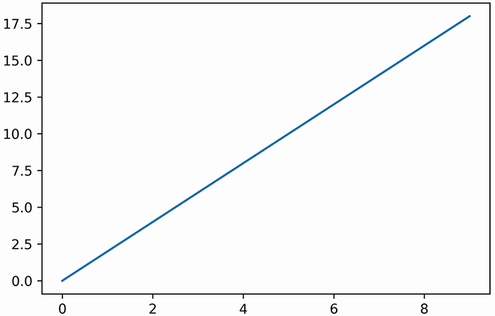

图 2.1 x 与 2x 的 Matplotlib 图。 x 变量表示整数 0 到 10。

警告 线性图中的轴不是均匀分布的，因此绘制线的斜率看起来没有实际陡峭。我们可以通过调用 plt.axis('equal') 来均衡两个轴。然而，这将导致包含太多空白空间的尴尬可视化。在整本书中，我们依靠 Matplotlib 的自动轴调整，同时也仔细观察调整后的长度。

可视化完成。在其中，我们的 10 个 y 轴点已使用平滑线段连接起来。如果我们更喜欢单独可视化 10 个点，我们可以使用 plt.scatter 方法（图 2.2）。

```python
plt.scatter(x, y)
plt.show()
```

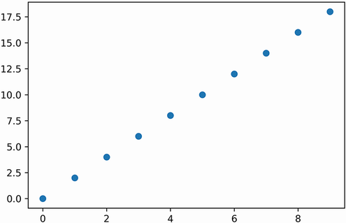

图 2.2 x 与 2 * x 的 Matplotlib 散点图。 x 变量表示整数 0 到 10。单个整数在图中显示为散点。

假设我们要强调 x 从 2 开始到 6 结束的区间。我们通过使用 plt.fill_between 方法在指定区间内对绘制曲线下方的区域进行着色来实现这一点。该方法将 x 和 y 以及定义区间覆盖范围的 where 参数作为输入。 where 参数的输入是一个布尔值列表，如果相应索引处的 x 值落在我们指定的区间内，则其中一个元素为 True。在下面的代码中，我们将 where 参数设置为等于 [is_in_interval(value, 2, 6) for value in x]。我们还执行 plt.plot(x,y) 将阴影区间与平滑连接的线并置（图 2.3）。

```python
plt.plot(x, y)
where = [is_in_interval(value, 2, 6) for value in x]
plt.fill_between(x, y, where=where)
plt.show()
```

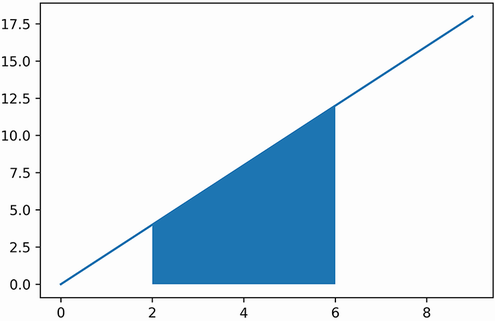

图 2.3 带有阴影区间的连通图。区间涵盖 2 到 6 之间的所有值。

到目前为止，我们已经回顾了三种可视化方法：plt.plot、plt.scatter 和 plt.fill_between。让我们在一个图中执行所有三种方法（图 2.4）。这样做会突出显示连续线下方的间隔，同时还会暴露单个坐标。

```python
plt.scatter(x, y)
plt.plot(x, y)
plt.fill_between(x, y, where=where)
plt.show()
```

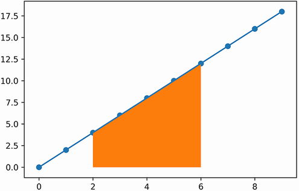

图 2.4 连接图和散点图结合阴影区间。图中的单个整数显示为标记一条平滑、不可分割的线的点。

没有描述性的 x 轴和 y 轴标签，任何数据图都不会真正完整。可以使用 plt.xlabel 和 plt.ylabel 方法设置此类标签（图 2.5）。

```python
plt.plot(x, y)
plt.xlabel('Values between zero and ten')
plt.ylabel('Twice the values of x')
plt.show()
```

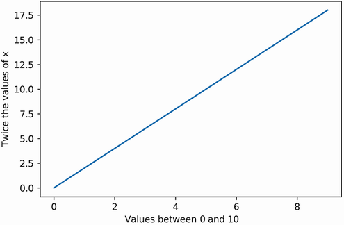

图 2.5 带有 x 轴和 y 轴标签的 Matplotlib 图

> 常见的 Matplotlib 方法
>
> plt.plot(x, y) - 绘制 x 的元素与 y 的元素。绘制的点使用平滑的线段连接。
> plt.scatter(x, y) - 绘制 x 的元素与 y 的元素。绘制的点单独可视化，不通过任何线连接。
> plt.fill_between(x, y, where=booleans) - 突出显示绘制曲线下方的区域子集。该曲线是通过绘制 x 与 y 来获得的。 where 参数定义了所有突出显示的间隔；它需要一个对应于 x 元素的布尔值列表。如果其对应的 x 值位于突出显示的区间内，则每个布尔值为 True。
> plt.xlabel(label) - 将绘制曲线的 x 标签设置为相等标签。
> plt.ylabel(label) - 将绘制曲线的 y 标签设置为相等标签。

## 2.2 绘制抛硬币概率
我们现在有工具来可视化硬币翻转计数和正面概率之间的关系。在第 1 部分中，我们检查了在一系列抛硬币中看到 80% 或更多正面的概率。随着掷硬币次数的增加，这种可能性会降低，我们想知道原因。我们很快就会通过绘制人头数与其相关的掷硬币组合数的关系来找出答案。这些值已经在我们的第 1 部分分析中计算出来了。 weighted_sample_space 字典中的键包含 10 个翻转硬币的所有可能的头数。这些人头计数映射到组合计数。同时，weighted_sample_space_20_flips 字典包含 20 个翻转硬币的人数映射。

我们的目标是比较来自这两个词典的绘制数据。我们首先绘制 weighted_sample_space 的元素：我们在 x 轴上绘制它的键，在 y 轴上绘制相关值。 x 轴对应于“头数”，y 轴对应于“x 头的硬币翻转组合数”。我们使用散点图直接可视化键值关系，而无需连接任何绘制点（图 2.6）。

```python
x_10_flips = list(weighted_sample_space.keys())
y_10_flips = [weighted_sample_space[key] for key in x_10_flips]
plt.scatter(x_10_flips, y_10_flips)
plt.xlabel('Head-count')
plt.ylabel('Number of coin-flip combinations with x heads')
plt.show()
```

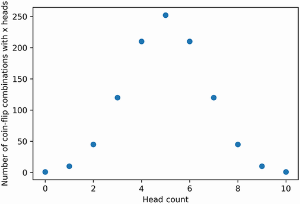

图 2.6 10 个翻转硬币的样本空间的散点图表示。对称图以 10 个计数头中的 5 个处的峰值为中心。

可视化样本空间呈现对称形状。对称性设置在峰值人数为 5 左右。因此，接近 5 的人数组合比远离 5 的人数更频繁。正如我们在上一节中了解到的，这些频率对应于概率。因此，人数越接近 5 的可能性越大。让我们通过直接在 y 轴上绘制概率来强调这一点（图 2.7）。概率图将允许我们用更简洁的“概率”替换我们冗长的 y 轴标签。我们可以通过将现有组合计数除以总样本空间大小来计算 y 轴概率。

```python
sample_space_size = sum(weighted_sample_space.values())
prob_x_10_flips = [value / sample_space_size for value in y_10_flips]
plt.scatter(x_10_flips, prob_x_10_flips)
plt.xlabel('Head-count')
plt.ylabel('Probability')
plt.show()
```

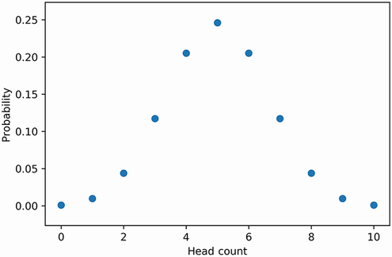

图 2.7 将人数与其发生概率映射的散点图。可以通过直接查看图来推断概率。

我们的绘图允许我们直观地估计任何人数的概率。因此，仅通过看图，我们就可以确定观察到五个正面的概率约为 0.25。 x 值和概率之间的这种映射称为概率分布。概率分布表现出某些数学上一致的特性，使它们可用于似然分析。例如，考虑任何概率分布的 x 值：它们对应于随机变量 r 的所有可能值。 r 落在某个区间内的概率等于该区间跨度内概率曲线下方的面积。因此，概率分布下方的总面积始终等于 1.0。这适用于任何分布，包括我们的人数图。代码 2.9 通过执行 sum(prob_ x_10_flips) 确认了这一点。

注意我们可以使用垂直矩形计算每个人数概率 p 下方的面积。矩形的高度是 p。矩形的宽度为 1.0，因为 x 轴上所有连续的人头计数都相隔一个单位。因此，矩形的面积是 p * 1.0，等于 p。因此，分布下方的总面积等于 sum([p for p in prob_x_10_flips])。在第 3 节中，我们将深入探讨如何使用矩形来确定面积。

```python
assert sum(prob_x_10_flips) == 1.0
```

8 到 10 人头计数区间下方的区域等于观察到 8 个或更多人头的概率。让我们使用 plt.fill_ between 方法可视化该区域。我们还利用 plt.plot 和 plt.scatter 来显示包含阴影区间的个人人数（图 2.8）。

```python
plt.plot(x_10_flips, prob_x_10_flips)
plt.scatter(x_10_flips, prob_x_10_flips)
where = [is_in_interval(value, 8, 10) for value in x_10_flips]
plt.fill_between(x_10_flips, prob_x_10_flips, where=where)
plt.xlabel('Head-count')
plt.ylabel('Probability')
plt.show()
```

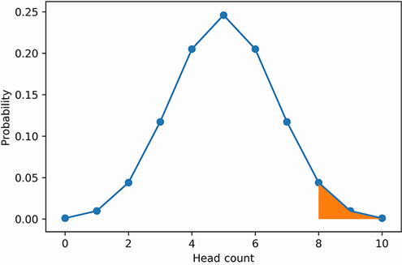

图 2.8 硬币翻转概率分布的叠加平滑图和散点图表示。阴影区间涵盖 8 到 10 次人头数。阴影区域等于观察到八个或更多人头的概率。

注意我们特意平滑了阴影间隔以制作视觉上吸引人的图。然而，真正的区间区域并不平滑：它由离散的矩形块组成，类似于台阶。这些步骤是离散的，因为人数是不可分割的整数。如果我们希望可视化实际的阶梯形区域，我们可以将 ds="steps-mid" 参数传递给 plt.plot，将 step="mid" 参数传递给 plt.fill_between。

现在，让我们也对划分观察八个或更多尾巴的概率的区间进行着色。以下代码突出显示了概率分布两端的极值（图 2.9）。

```python
plt.plot(x_10_flips, prob_x_10_flips)
plt.scatter(x_10_flips, prob_x_10_flips)
where = [not is_in_interval(value, 3, 7) for value in x_10_flips]
plt.fill_between(x_10_flips, prob_x_10_flips, where=where)
plt.xlabel('Head-count')
plt.ylabel('Probability')
plt.show()
```

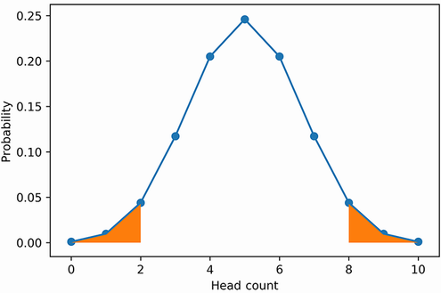

图 2.9 硬币翻转概率分布的叠加平滑图和散点图表示。两个阴影区间跨越了极端数量的正面和反面。区间是对称的，从视觉上暗示它们的概率是相等的。

两个对称的阴影区间覆盖了硬币翻转曲线的左右尾端。根据我们之前的分析，我们知道观察到超过七个正面或反面的概率约为 10%。因此，每个对称阴影尾段应覆盖曲线下总面积的大约 5%。

### 2.2.1 比较多个抛硬币概率分布

绘制 10 枚硬币翻转分布可以更容易地直观地理解相关的区间概率。让我们扩展我们的图以包含 20 个翻转硬币的分布。我们将在一个图形上绘制这两种分布，尽管首先我们必须计算 20 枚硬币翻转分布的 x 轴人头数和 y 轴概率。

```python
x_20_flips = list(weighted_sample_space_20_flips.keys())
y_20_flips = [weighted_sample_space_20_flips[key] for key in x_20_flips]
sample_space_size = sum(weighted_sample_space_20_flips.values())
prob_x_20_flips = [value / sample_space_size for value in y_20_flips]
```

现在我们准备同时可视化这两个分布（图 2.10）。我们通过在两个概率分布上执行 plt.plot 和 plt.scatter 来做到这一点。我们还将一些与样式相关的参数传递到这些方法调用中。参数之一是颜色：为了区分第二个分布，我们通过传递 color='black' 将其颜色设置为黑色。或者，我们可以通过传递“k”（Matplotlib 的黑色单字符代码）来避免输入整个颜色名称。我们可以通过其他方式使第二个分布脱颖而出：将 linestyle=='--' 传递到 plt.plot 确保分布点使用虚线而不是常规线连接。我们还可以通过将 marker='x' 传递到 plt.scatter 来使用 x 形标记而不是实心圆来区分各个点。最后，我们通过将 label 参数传递给我们的两个 plt.plot 调用中的每一个并执行 plt.legend() 方法来显示图例，从而为我们的图形添加图例。在图例中，10 枚硬币翻转分布和 20 枚硬币翻转分布分别标记为 A 和 B。

```python
plt.plot(x_10_flips, prob_x_10_flips, label='A: 10 coin-flips')
plt.scatter(x_10_flips, prob_x_10_flips)
plt.plot(x_20_flips, prob_x_20_flips, color='black', linestyle='--',
        label='B: 20 coin-flips')
plt.scatter(x_20_flips, prob_x_20_flips, color='k', marker='x')
plt.xlabel('Head-count')
plt.ylabel('Probability')
plt.legend()
 
plt.show()
```

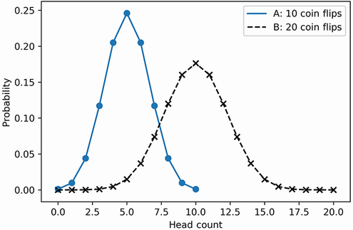

图 2.10 掷硬币 10 次 (A) 和掷硬币 20 次 (B) 的概率分布。 20 枚硬币翻转分布由虚线和 x 形散点标记。

> 常见的 Matplotlib 样式参数
>
> - 颜色 - 确定绘制输出的颜色。此设置可以是颜色名称或单字符代码。 color='black' 和 color='k' 生成黑色图，color='red' 和 color='r' 生成红色图。
> - linestyle - 确定连接数据点的绘制线的样式。它的默认值等于“-”。输入linestyle='-'生成连接线，linestyle='--'生成虚线，linestyle=':'生成虚线，linestyle='.'生成由交替的点和破折号组成的线。
> - 标记 - 确定分配给单独绘制的点的标记样式。它的默认值等于'o'。输入marker='o'生成一个圆形标记，marker='x'生成一个x形标记，marker='s'生成一个方形标记，而marker='p'生成一个五边形标记。
> - label - 将标签映射到指定的颜色和样式。此映射出现在图例中。需要对 plt.legend() 进行后续调用才能使图例可见。

我们已经可视化了我们的两个分布。接下来，我们突出显示两条曲线中每条曲线的兴趣区间（80% 正面或反面）（图 2.11）。请注意，分布 B 尾部下方的区域非常小；我们移除散点以更清楚地突出尾端间隔。我们还用更透明的 linestyle=':' 替换了分布 B 的线型。

```python
plt.plot(x_10_flips, prob_x_10_flips, label='A: 10 coin-flips')
plt.plot(x_20_flips, prob_x_20_flips, color='k', linestyle=':',
         label='B: 20 coin-flips')
 
where_10 = [not is_in_interval(value, 3, 7) for value in x_10_flips]
plt.fill_between(x_10_flips, prob_x_10_flips, where=where_10)
where_20 = [not is_in_interval(value, 5, 15) for value in x_20_flips]
plt.fill_between(x_20_flips, prob_x_20_flips, where=where_20)
 
plt.xlabel('Head-Count')
plt.ylabel('Probability')
plt.legend()
plt.show()
```

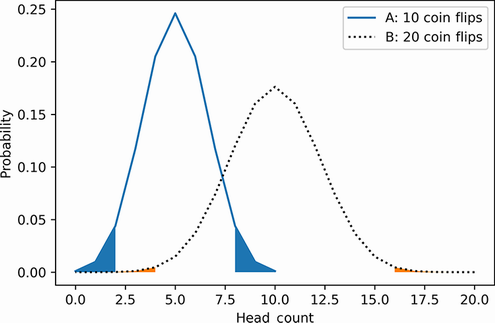

图 2.11 掷硬币 10 次（A）和掷硬币 20 次（B)的概率分布。两个分布下方的阴影区间代表极端数量的正面和反面。 B 下方的阴影区间占 A 下方阴影区间面积的十分之一。

分布 B 尾端下方的阴影区域远低于分布 A 下方的阴影区间。这是因为分布 A 具有更肥、更高的尾端，覆盖了更厚的区域数量。尾部的粗细说明了区间概率的差异。

可视化是有用的，但前提是我们突出显示两条曲线下方的间隔区域。如果没有对 plt.fill_between 的调用，我们就无法回答我们之前提出的问题：为什么随着公平硬币翻转的次数增多，观察到 80% 或更多正面的概率会降低？答案很难推断，因为这两个分布几乎没有重叠，因此很难进行直接的视觉比较。也许我们可以通过对齐分布峰值来改进绘图。分布 A 以 5 次人头计数（每 10 次抛硬币）为中心，分布 B 以 10 次人头计数（共 20 次抛硬币）为中心。如果我们将人头计数转换为频率（通过除以总抛硬币次数），那么两个分布峰值应该以 0.5 的频率对齐。转换还应使我们的人数间隔 8 到 10 和 16 到 20 保持一致，以便它们都位于 0.8 到 1.0 的区间内。让我们执行这个转换并重新生成图（图 2.12）。

```python
x_10_frequencies = [head_count /10 for head_count in x_10_flips]
x_20_frequencies = [head_count /20 for head_count in x_20_flips]
 
plt.plot(x_10_frequencies, prob_x_10_flips, label='A: 10 coin-flips')
plt.plot(x_20_frequencies, prob_x_20_flips, color='k', linestyle=':', label='B: 20 coin-flips')
plt.legend()
 
plt.xlabel('Head-Frequency')
plt.ylabel('Probability')
plt.show()
```

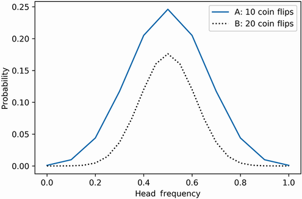

图 2.12 根据概率绘制的 10 次抛硬币 (A) 和 20 次抛硬币 (B) 的人数频率。两个 y 轴峰都以 0.5 的频率对齐。 A 的面积完全覆盖了 B 的面积，因为每个地块的总面积不再为 1.0。

正如预期的那样，两个峰现在都在 0.5 的头部频率处对齐。但是，我们按人数划分后，两条曲线下方的面积分别减少了 10 倍和 20 倍。每条曲线下方的总面积不再等于 1.0。这是一个问题：正如我们所讨论的，如果我们希望推断区间概率，曲线下的总面积必须为 1.0。但是，如果我们将曲线 A 和 B 的 y 轴值乘以 10 和 20，我们可以修复面积总和。调整后的 y 值将不再指概率，因此我们必须为它们命名。使用的适当术语是相对可能性，它在数学上是指总面积为 1.0 的曲线内的 y 轴值。因此，我们将新的 y 轴变量命名为relative_likelihood_10 和relative_likelihood_20。

```python
relative_likelihood_10 = [10 * prob for prob in prob_x_10_flips]
relative_likelihood_20 = [20 * prob for prob in prob_x_20_flips]
```

转换完成。是时候绘制我们的两条新曲线，同时突出显示与 where_10 和 where_20 布尔数组相关的区间（图 2.13）。

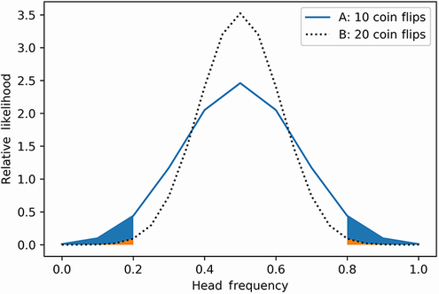

图 2.13 10 次抛硬币 (A) 和 20 次抛硬币 (B) 的人数频率与其相对可能性的关系图。两个图下方的阴影区间代表极端数量的正面和反面。这些区间的面积对应于概率，因为每个地块的总面积总和为 1.0。

在图中，曲线 A 类似于一个短而宽肩的健美运动员，而曲线 B 可以比作一个更高更瘦的人。由于曲线 A 更宽，它在更极端的头部频率间隔上的面积更大。因此，当硬币翻转计数为 10 而不是 20 时，观察到的此类频率记录更有可能发生。同时，更细、更垂直的曲线 B 覆盖了中心频率 0.5 周围的更多区域。

如果我们抛超过 20 个硬币，这将如何影响我们的频率分布？根据概率论，每一次额外的硬币翻转都会导致频率曲线变得更高更细（图 2.14）。曲线会像一条被垂直向上拉的拉伸橡皮筋一样变形：它会减少厚度以换取垂直长度。随着抛硬币的总数达到数百万和数十亿，曲线将完全失去周长，成为一个非常长的垂直峰值，其中心位于 0.5 的频率处。超过该频率，垂直线下方不存在的区域将接近零。因此，峰值下方的面积将接近 1.0，因为我们的总面积必须始终等于 1.0。 1.0 的面积对应于 1.0 的概率。因此，随着抛硬币的次数接近无穷大，正面的频率将完全等于正面的实际概率。

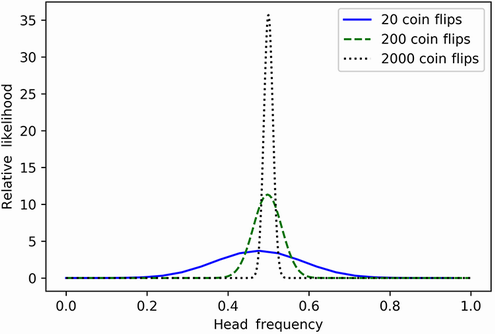

图 2.14 在不断增加的硬币翻转次数中绘制的假设人数频率。所有 y 轴峰都以 0.5 的频率对齐。随着硬币翻转次数的增加，峰值变得更高和更窄。在掷硬币 2,000 次时，峰值的收缩区域几乎完全集中在 0.5 处。通过无限次抛硬币，产生的峰值应该延伸成一条垂直线，完美地定位在 0.5 处。

无限抛硬币和绝对确定性之间的关系由概率论中的一个基本定理：大数定律来保证。根据该定律，当观察次数增加时，观察的频率与该观察的概率几乎无法区分。因此，如果有足够的硬币翻转，我们正面的频率将等于正面的实际概率，即 0.5。除了抛硬币之外，我们还可以将定律应用于更复杂的现象，例如纸牌游戏。如果我们运行足够多的纸牌游戏模拟，那么我们获胜的频率将等于获胜的实际概率。

在接下来的部分中，我们将展示如何将大数定律与随机模拟相结合来逼近复概率。最终，我们将执行模拟以找出随机抽取卡片的概率。然而，正如大数定律所表明的那样，这些模拟必须在计算成本高的大型规模上运行。因此，高效的仿真实现需要我们熟悉NumPy数值计算库。该库在第 3 节中讨论。

## 概括

- 通过绘制每个可能的数值观察与其概率的关系，我们生成了一个概率分布。概率分布下的总面积总和为 1.0。分布的特定区间下方的面积等于在该区间内观察到某个值的概率。
- 概率分布的 y 轴值不一定需要等于概率，只要绘制的区域总和为 1.0。
- 公平抛硬币序列的概率分布类似于对称曲线。它的 x 轴人头数可以转换成频率。在该转换期间，我们可以通过将 y 轴概率转换为相对可能性来保持面积为 1.0。转换曲线的峰值以频率 0.5 为中心。如果硬币翻转次数增加，那么随着曲线两侧变窄，峰值也会上升。
- 根据大数定律，随着观察次数的增加，任何观察的频率都会接近该观察的概率。因此，随着硬币翻转次数的增加，公平硬币分布以其中心频率 0.5 为主。