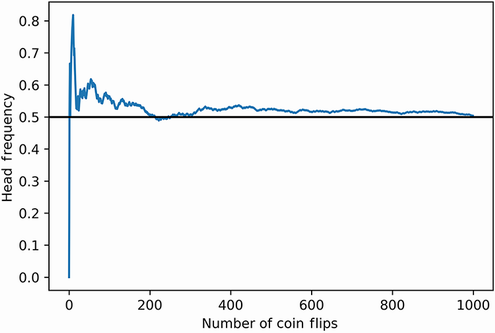
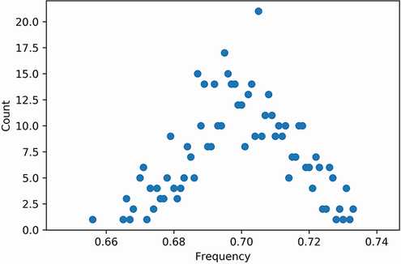
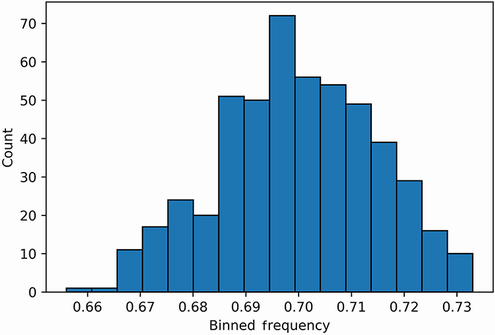
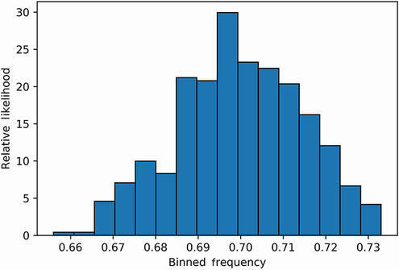
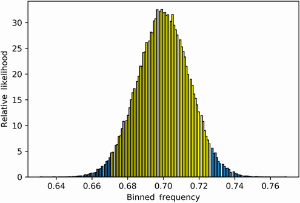
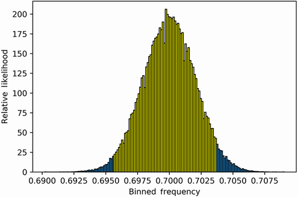

本节涵盖

- NumPy 库的基本用法
- 使用 NumPy 模拟随机观察
- 可视化模拟数据
- 从模拟观察中估计未知概率

NumPy 代表 Numerical Python，是支持 Pythonic 数据科学的引擎。尽管 Python 有许多优点，但它根本不适合大规模数值分析。因此，数据科学家必须依靠外部 NumPy 库来有效地操作和存储数字数据。 NumPy 是一个非常强大的工具，用于处理大量原始数字。因此，许多 Python 的外部数据处理库都与 NumPy 兼容。一个这样的库是 Matplotlib，我们在上一节中介绍过。本书后面的部分将讨论其他 NumPy 驱动的库。本节重点介绍随机数值模拟。我们将使用 NumPy 来分析数十亿个随机数据点；这些随机观察将使我们能够学习隐藏的概率。

## 3.1 使用 NumPy 模拟随机抛硬币和掷骰子

NumPy 应该已经作为 Matplotlib 要求之一安装在您的工作环境中。让我们根据常见的 NumPy 使用约定将 NumPy 导入为 np。

注意 NumPy 也可以独立于 Matplotlib 安装，方法是从命令行终端调用 pip install numpy。

```python
import numpy as np
```

现在导入了 NumPy，我们可以使用 np.random 模块进行随机模拟。该模块可用于生成随机值和模拟随机过程。例如，调用 np.random.randint(1, 7) 会产生一个介于 1 和 6 之间的随机整数。该方法从六个可能的整数中以相同的可能性进行选择，从而模拟标准骰子的单次滚动。

```python
die_roll = np.random.randint(1, 7)
assert 1 <= die_roll <= 6
```

生成的 die_roll 值是随机的，其分配的值会因本书的读者而异。不一致可能导致难以在本节中完美地重新创建某些随机模拟。我们需要一种方法来确保我们所有的随机输出都可以在家中复制。方便的是，通过调用 np.random.seed(0) 可以很容易地保持一致性；此方法调用使随机选择的值序列可重现。调用后，我们可以直接保证我们的前三个骰子将落在值 5、6 和 1 上。

```python
np.random.seed(0)
die_rolls = [np.random.randint(1, 7) for _ in range(3)]
assert die_rolls == [5, 6, 1]
```

将输入的 x 调整为 np.random.randint(0, x) 允许我们模拟任意数量的离散结果。例如，将 x 设置为 52 将模拟随机抽取的卡片。或者，将 x 设置为 2 将模拟无偏硬币的单次翻转。让我们通过调用 np.random.randint(0, 2);此方法调用返回一个等于 0 或 1 的随机值。我们假设 0 代表尾部，1 代表正面。

```python
np.random.seed(0)
coin_flip = np.random.randint(0, 2)
print(f"Coin landed on {'heads' if coin_flip == 1 else 'tails'}")

Coin landed on tails
```

接下来，我们模拟 10 次抛硬币的序列，然后计算观察到的正面朝上的频率。

```python
np.random.seed(0)
def frequency_heads(coin_flip_sequence):
    total_heads = len([head for head in coin_flip_sequence if head == 1])  ❶
    return total_heads / len(coin_flip_sequence)
 
coin_flips = [np.random.randint(0, 2) for _ in range(10)]
freq_heads = frequency_heads(coin_flips)
print(f"Frequency of Heads is {freq_heads}")

Frequency of Heads is 0.8
```

❶ 请注意，我们可以通过运行 sum(coin_flip_sequence) 来更有效地计算人头数。
观察到的频率是 0.8，这与正面的实际概率非常不成比例。然而，正如我们所了解到的，大约 10% 的时间掷硬币 10 次会产生如此极端的频率。需要更多的硬币翻转来估计实际概率。

让我们看看当我们抛硬币 1,000 次时会发生什么。每次翻转后，我们记录序列中观察到的正面的总频率。抛硬币完成后，我们通过绘制抛硬币计数与频率计数的关系图来可视化我们的输出（图 3.1）。我们的图还包括一条沿着实际概率 0.5 的水平线。我们通过调用 plt.axhline(0.5, color='k') 生成那条线。

```python
np.random.seed(0)
coin_flips = []
frequencies = []
for _ in range(1000):
    coin_flips.append(np.random.randint(0, 2))
    frequencies.append(frequency_heads(coin_flips))
 
plt.plot(list(range(1000)), frequencies)
plt.axhline(0.5, color='k')
plt.xlabel('Number of Coin Flips')
```



图 3.1 相对于观察到的人头计数频率绘制的公平抛硬币次数。频率在稳定在 0.5 左右之前剧烈波动。

正面朝上的概率慢慢收敛到 0.5。因此，大数定律似乎成立。

### 3.1.1 分析有偏差的抛硬币

我们已经模拟了一系列无偏硬币翻转，但是如果我们希望模拟 70% 的时间都朝正面的硬币呢？好吧，我们可以通过调用 np.random.binomial(1, 0.7) 来生成有偏差的输出。二项式方法名称指的是通用的硬币翻转分布，数学家称之为二项式分布。该方法将两个参数作为输入：掷硬币的次数和期望的掷硬币结果的概率。该方法执行指定数量的有偏硬币翻转，然后计算观察到所需结果的实例。当硬币翻转次数设置为 1 时，该方法返回一个二进制值 0 或 1。在我们的例子中，值 1 表示我们期望的正面观察。

```python
np.random.seed(0)
print("Let's flip the biased coin once.")
coin_flip = np.random.binomial(1, 0.7)
print(f"Biased coin landed on {'heads' if coin_flip == 1 else 'tails'}.")
 
print("\nLet's flip the biased coin 10 times.")
number_coin_flips = 10
head_count = np.random.binomial(number_coin_flips, .7)
print((f"{head_count} heads were observed out of "
       f"{number_coin_flips} biased coin flips"))
Let's flip the biased coin once.
Biased coin landed on heads.
 
Let's flip the biased coin 10 times.
6 heads were observed out of 10 biased coin flips
```

让我们生成一个包含 1,000 次偏置硬币翻转的序列。然后我们检查频率是否收敛到 0.7。

```python
np.random.seed(0)
head_count = np.random.binomial(1000, 0.7)
frequency = head_count / 1000
print(f"Frequency of Heads is {frequency}")
 
Frequency of Heads is 0.697
```

正面的频率接近 0.7，但实际上并不等于 0.7。事实上，频率值比正面正面的真实概率小 0.003 个单位。假设我们再重新计算 1,000 次硬币翻转的频率五次。所有的频率都会低于0.7吗？某些频率会达到 0.7 的准确值吗？我们将通过在五次循环迭代中执行 np.random.binomial(1000, 0.7) 来找出答案。

```python
np.random.seed(0)
assert np.random.binomial(1000, 0.7) / 1000 == 0.697     ❶
for i in range(1, 6):
    head_count = np.random.binomial(1000, 0.7)
    frequency = head_count / 1000
    print(f"Frequency at iteration {i} is {frequency}")
    if frequency == 0.7:
        print("Frequency equals the probability!\n")
 
Frequency at iteration 1 is 0.69
Frequency at iteration 2 is 0.7
Frequency equals the probability!
 
Frequency at iteration 3 is 0.707
Frequency at iteration 4 is 0.702
Frequency at iteration 5 is 0.699
```

❶ 提醒一下，我们为随机数生成器设置了种子以保持一致的输出。因此，我们的第一次伪随机采样将返回先前观察到的频率 0.697。我们将跳过此结果以生成五个新频率。
五次迭代中只有一次产生了等于真实概率的测量值。两次测得的频率略低，两次略高。观察到的频率似乎在每次 1,000 次抛硬币的采样中波动。似乎即使大数定律允许我们近似实际概率，但仍然存在一些不确定性。数据科学有点混乱，我们不能总是确定我们从数据中得出的结论。尽管如此，我们的不确定性可以使用数学家所说的置信区间来衡量和控制。

## 3.2 使用直方图和 NumPy 数组计算置信区间

假设我们拿到了一枚有偏见的硬币，我们不知道它的偏见。我们将硬币翻转 1,000 次并观察到 0.709 的频率。我们知道频率接近实际概率，但多少呢？更准确地说，实际概率落在接近 0.709 的区间内（例如 0.7 和 0.71 之间的区间）的几率有多大？为了找出答案，我们必须进行额外的抽样。

我们之前已经对我们的硬币进行了五次迭代，每次 1,000 次抛硬币。采样产生了一些频率波动。让我们通过将频率计数从 5 增加到 500 来探索这些波动。我们可以通过运行 [np.random.binomial(1000, 0.7) for _ in range(500)] 来执行此补充采样。

```python
np.random.seed(0)
head_count_list = [np.random.binomial(1000, 0.7) for _ in range(500)]
```

但是，我们可以通过运行 np.random.binomial(coin_flip_count, 0.7, size=500) 更有效地对 500 次迭代进行采样。可选的 size 参数允许我们在使用 NumPy 的内部优化时执行 np.random.binomial(coin_flip_count, 0.7) 500 次。

```python
np.random.seed(0)
head_count_array = np.random.binomial(1000, 0.7, 500)
```

输出不是 Python 列表，而是 NumPy 数组数据结构。如前所述，NumPy 数组可以更有效地存储数字数据。存储在 head_count_array 和 head_count_list 中的实际数字量保持不变。我们通过使用 head_count_array.tolist() 方法将数组转换为列表来证明这一点。

```python
assert head_count_array.tolist() == head_count_list
```

相反，我们也可以通过调用 np.array(head_count_list) 将我们的 Python 列表转换为值等价的 NumPy 数组。可以使用 np.array_equal 方法确认转换后的数组和 head_count_array 之间的相等性。

```python
new_array = np.array(head_count_list)
assert np.array_equal(new_array, head_count_array) == True
```

为什么我们更喜欢使用 NumPy 数组而不是标准 Python 列表？好吧，除了前面提到的内存优化和分析加速之外，NumPy 还可以更轻松地实现干净的代码。例如，NumPy 提供了更直接的乘法和除法。将 NumPy 数组直接除以 x 会创建一个新数组，其元素都被 x 除。因此，执行 head_count_array / 1000 将自动将我们的人数转换为频率。相比之下，head_count_list 的频率计算要求我们迭代列表中的所有元素或使用 Python 的卷积映射函数。

```python
frequency_array = head_count_array / 1000
assert frequency_array.tolist() == [head_count / 1000 for head_count in head_count_list]
assert frequency_array.tolist() == list(map(lambda x: x / 1000, head_count_list))
```

> 用于运行随机模拟的有用 NumPy 方法
>
> - np.random.randint(x, y) - 返回 x 和 y-1 之间的一个随机整数，包括两个。
> - np.random.binomial(1, p) - 返回一个等于 0 或 1 的随机值。该值等于 1 的概率是 p。
> - np.random.binomial(x, p) - 运行 np.random.binomial (1, p) 的 x 个实例并返回求和结果。返回的值表示跨 x 个样本的非零观测数。
> - np.random.binomial(x, p, size=y) - 返回一个包含 y 元素的数组。每个数组元素等于 np.random.binomial(x, p) 的随机输出。
> - np.random.binomial(x, p, size=y) / x - 返回 y 元素的数组。每个元素代表跨 x 个样本的非零观察的频率。

我们使用简单的除法运算将人头数数组转换为频率数组。让我们更详细地探索 frequency_array 的内容。我们首先使用 Python 列表使用的相同 : 索引切片分隔符输出前 20 个采样频率。请注意，与打印列表不同，NumPy 数组在其输出中不包含逗号。

```python
print(frequency_array[:20])
 
[ 0.697  0.69   0.7    0.707  0.702  0.699  0.723  0.67   0.702  0.713
  0.721  0.689  0.711  0.697  0.717  0.691  0.731  0.697  0.722  0.728]
```

采样频率在 0.69 到大约 0.731 之间波动。当然，frequency_array 中还保留了额外的 480 个频率。让我们通过调用 frequency_array.min() 和 frequency_array.max() 方法来提取最小和最大数组值。

```python
min_freq = frequency_array.min()
max_freq = frequency_array.max()
print(f"Minimum frequency observed: {min_freq}")
print(f"Maximum frequency observed: {max_freq}")
print(f"Difference across frequency range: {max_freq - min_freq}")

Minimum frequency observed: 0.656
Maximum frequency observed: 0.733
Difference across frequency range: 0.07699999999999996
```

在 0.656 到 0.733 频率范围内的某处是正面朝上的真实概率。该区间跨度非常大，最大和最小采样值之间的差异超过 7%。也许我们可以通过绘制所有独特频率与其出现次数的关系来缩小频率范围（图 3.2）。



图 3.2 对频率计数绘制的 500 个人头计数频率的散点图。频率以 0.7 为中心。某些近似频率在图中显示为重叠点。

```python
frequency_counts = defaultdict(int)
for frequency in frequency_array:
    frequency_counts[frequency] += 1
 
frequencies = list(frequency_counts.keys())
counts = [frequency_counts[freq] for freq in frequencies]
plt.scatter(frequencies, counts)
plt.xlabel('Frequency')
plt.ylabel('Count')
plt.show()
```

可视化提供了信息：接近 0.7 的频率比其他更远的值更常见。然而，我们的图也有缺陷，因为几乎相同的频率在图表中显示为重叠点。我们应该将这些近似频率组合在一起，而不是将它们视为单独的点。

### 3.2.1 在直方图中分箱相似点

让我们通过将彼此非常接近的频率合并在一起来尝试更细致的可视化。我们将频率范围细分为 N 个等距的 bin，然后将所有频率值放入这些 bin 之一。根据定义，任何给定 bin 中的值最多相隔 1/N 个单位。然后我们计算每个 bin 中的总值，并使用绘图将计数可视化。

我们刚刚描述的基于 bin 的图称为直方图。我们可以通过调用 plt.hist 在 Matplotlib 中生成直方图。该方法将要分箱的值序列和可选的 bins 参数作为输入，该参数指定了 bin 的总数。因此，调用 plt.hist(frequency_array, bins=77) 会将我们的数据分成 77 个 bin，每个 bin 的宽度为 0.01 个单位。或者，我们可以传入 bins=auto，Matplotlib 将使用常见的优化技术选择合适的 bin 宽度（其细节超出了本书的范围）。让我们通过调用 plt.hist(frequency_array, bins='auto') 在优化 bin 宽度的同时绘制直方图（图 3.3）。

注意在清单 3.18 中，我们还包含了一个 edgecolor='black' 参数。这有助于我们通过将 bin 边缘着色为黑色来在视觉上区分 bin 之间的边界。

```python
plt.hist(frequency_array, bins='auto', edgecolor='black')
plt.xlabel('Binned Frequency')
plt.ylabel('Count')
plt.show()
```

在我们绘制的直方图中，频率计数最高的 bin 介于 0.69 和 0.70 之间。这个垃圾箱明显高于十几个其他垃圾箱。我们可以使用 counts 获得更精确的 bin 计数，这是 plt.hist 返回的 NumPy 数组。该数组保存每个分箱组的 y 轴频率计数。让我们调用 plt.hist 返回计数，然后访问 counts.size 以查找分箱组的总数。

```python
counts, _, _ = plt.hist(
    frequency_array, bins='auto',    ❶
    edgecolor='black'
)
 
print(f"Number of Bins: {counts.size}")

Number of Bins: 16
```

❶ counts 是 plt.hist 返回的三个变量之一。本节稍后将讨论其他变量。
直方图中有 16 个 bin。每个箱子的宽度是多少？我们可以通过将总频率范围除以 16 来找出。或者，我们可以使用 bin_edges 数组，它是 plt.hist 返回的第二个变量。该数组保存图中垂直 bin 边缘的 x 轴位置。因此，任何两个连续边缘位置之间的差异等于 bin 宽度。

```python
counts, bin_edges, _ = plt.hist(frequency_array, bins='auto',
                                edgecolor='black')
 
bin_width = bin_edges[1] - bin_edges[0]
assert bin_width == (max_freq - min_freq) / counts.size
print(f"Bin width: {bin_width}")

Bin width: 0.004812499999999997
```



图 3.3 500 个分箱频率与每个分箱中元素数量的直方图。元素最多的 bin 以 0.7 的频率为中心。

注意 bin_edges 的大小总是比计数的大小大 1。为什么会这样？想象一下，如果我们只有一个矩形 bin：它将被两条垂直线包围。添加一个额外的 bin 也会将边界大小增加 1。如果我们将该逻辑外推到 N 个 bin，那么我们预计会看到 N + 1 条边界线。

bin_edges 数组可以与 counts 一起使用，以输出任何指定 bin 的元素计数和覆盖范围。让我们定义一个 output_bin_coverage 函数，该函数打印位置 i 处任何 bin 的计数和覆盖率。

```python
def output_bin_coverage(i):

    count = int(counts[i])                                 ❶
    range_start, range_end = bin_edges[i], bin_edges[i+1]  ❷
    range_string = f"{range_start} - {range_end}"
    print((f"The bin for frequency range {range_string} contains "
           f"{count} element{'' if count == 1 else 's'}"))
 
output_bin_coverage(0)
output_bin_coverage(5)
The bin for frequency range 0.656 - 0.6608125 contains 1 element
The bin for frequency range 0.6800625 - 0.684875 contains 20 elements
```

❶ 位置 i 处的一个 bin 包含 counts[i] 个频率。
❷ 位置 i 的 bin 覆盖了 bin_edges[i] 到 bin_edges[i+1] 的频率范围。
现在，让我们计算直方图中最高峰的计数和频率范围。为此，我们需要 counts.max() 的索引。方便的是，NumPy 数组有一个内置的 argmax 方法，它返回数组中最大值的索引。

```python
assert counts[counts.argmax()] == counts.max()
```

因此，调用 output_bin_coverage(counts.argmax()) 应该为我们提供我们请求的输出。

```python
output_bin_coverage(counts.argmax())
 
The bin for frequency range 0.6945 - 0.6993125 contains 72 elements
```

### 3.2.2 从直方图中推导出概率

直方图中占用最多的 bin 包含 72 个元素，覆盖大约 0.694 到 0.699 的频率范围。我们如何确定正面正面的实际概率是否在该范围内（事先不知道答案）？一种选择是计算随机测量的频率落在 0.694 到 0.699 之间的可能性。如果该可能性为 1.0，则该范围将覆盖 100% 的测量频率。这些测量的频率偶尔会包括正面的实际概率，因此我们 100% 有信心我们的真实概率介于 0.694 和 0.699 之间。即使可能性较低，为 95%，我们仍然相当有信心该范围包含我们的真实概率值。

我们应该如何计算可能性？早些时候，我们证明了区间的似然等于它在曲线下的面积，但前提是总绘制面积之和为 1.0。我们的直方图下方的面积大于 1.0，因此必须通过将 density=True 传递到 plt.hist 来修改。传递的参数保持直方图的形状，同时强制其面积的总和等于 1.0。

```python
likelihoods, bin_edges, _ = plt.hist(frequency_array, bins='auto',
                                     edgecolor='black', density=True)
plt.xlabel('Binned Frequency')
plt.ylabel('Relative Likelihood')
plt.show()
```

分箱计数现在已被存储在似然数组中的相对似然取代（图 3.4）。正如我们所讨论的，相对似然是一个应用于面积总和为 1.0 的图的 y 值的术语。当然，我们直方图下方的区域现在总和为 1.0。我们可以通过对每个 bin 的矩形面积求和来证明这一点，它等于 bin 的垂直似然值乘以 bin_width。因此，直方图下方的区域等于总似然乘以 bin_width。因此，调用 Similars.sum() * bin_width 应该返回 1.0 的面积。



图 3.4 500 个分箱频率的直方图，根据它们相关的相对可能性绘制。直方图的面积总和为 1.0。可以通过对每个 bin 的矩形区域求和来计算该区域。

注意总面积等于直方图中矩形面积的总和。在图 3.4 中，最长矩形的长度相当大，因此我们直观地估计总面积大于 1.0。

```python
assert likelihoods.sum() * bin_width == 1.0
```

直方图的总面积总和为 1.0。因此，直方图峰值下方的区域现在等于随机采样频率落在 0.694 到 0.699 区间范围内的概率。让我们通过计算位于 Likes.argmax() 的 bin 的面积来计算这个值。

```python
index = likelihoods.argmax()
area = likelihoods[index] * bin_width
range_start, range_end = bin_edges[index], bin_edges[index+1]
range_string = f"{range_start} - {range_end}"
print(f"Sampled frequency falls within interval {range_string} with probability {area}")

Sampled frequency falls within interval 0.6945 - 0.6993125 with probability 0.144
```

概率约为 14%。该值很低，但我们可以通过将间隔范围扩大到一个箱以上来增加它。我们扩展范围以覆盖在索引 Similars.argmax() - 1 和 Similars.argmax() + 1 处的相邻 bin。

注意 提醒一下，Python 的索引符号包括开始索引，不包括结束索引。因此，我们将结束索引设置为相等的可能性.argmax() + 2 以包括可能性.argmax() + 1。

```python
peak_index = likelihoods.argmax()
start_index, end_index = (peak_index - 1, peak_index + 2)
area = likelihoods[start_index: end_index + 1].sum() * bin_width
range_start, range_end = bin_edges[start_index], bin_edges[end_index]
range_string = f"{range_start} - {range_end}"
print(f"Sampled frequency falls within interval {range_string} with probability {area}")

Sampled frequency falls within interval 0.6896875 - 0.704125 with probability 0.464
```

这三个 bin 覆盖大约 0.689 到 0.704 的频率范围。它们的相关概率是 0.464。因此，三个 bin 代表了统计学家所说的 46.4% 置信区间，这意味着我们有 46.4% 的置信度，我们的真实概率落在三个 bin 范围内。这个置信度太低了。统计学家更喜欢 95% 或更高的置信区间。我们通过迭代扩展最左边的 bin 和最右边的 bin 来达到该置信区间，直到区间区域延伸超过 0.95。

```python
def compute_high_confidence_interval(likelihoods, bin_width):
    peak_index = likelihoods.argmax()
    area = likelihoods[peak_index] * bin_width
    start_index, end_index = peak_index, peak_index + 1
    while area < 0.95:
        if start_index > 0:
            start_index -= 1
        if end_index < likelihoods.size - 1:
            end_index += 1
 
        area = likelihoods[start_index: end_index + 1].sum() * bin_width
 
    range_start, range_end = bin_edges[start_index], bin_edges[end_index]
    range_string = f"{range_start:.6f} - {range_end:.6f}"
    print((f"The frequency range {range_string} represents a "
           f"{100 * area:.2f}% confidence interval"))
    return start_index, end_index
 
compute_high_confidence_interval(likelihoods, bin_width)

The frequency range 0.670438 - 0.723375 represents a 95.40% confidence interval
```

大约 0.670 到 0.723 的频率范围代表 95.4% 的置信区间。因此，1,000 次偏置硬币翻转的采样序列应该在 95.4% 的时间内落在该范围内。我们相当确信真实概率介于 0.670 和 0.723 之间。但是，我们仍然无法确定真实概率是更接近 0.67 还是 0.72。我们需要以某种方式缩小该范围以获得更多信息的概率估计。

### 3.2.3 缩小高置信区间的范围

我们如何在保持 95% 的置信区间的同时缩小我们的范围？也许我们应该尝试将频率计数从 500 提升到明显更大的数量。以前，我们采样了 500 个频率，其中每个频率代表 1,000 次有偏差的硬币翻转。相反，让我们对 100,000 个频率进行采样，同时将硬币翻转计数保持在 1,000。

```python
np.random.seed(0)
head_count_array = np.random.binomial(1000, 0.7, 100000)
frequency_array = head_count_array / 1000
assert frequency_array.size == 100000
```

我们将重新计算更新后的 frequency_array 上的直方图，它现在拥有 200 倍的频率元素。然后我们可视化该直方图，同时搜索高置信区间。让我们通过在其范围内对直方图条进行着色来将置信区间纳入我们的可视化中（图 3.5）。直方图条可以通过依赖补丁进行可视化修改，补丁是 plt.hist 返回的第三个变量。索引 i 处每个 bin 的图形详细信息可通过 patch[i] 访问。如果我们希望将第 i 个 bin 着色为黄色，我们可以简单地调用 patch[i].set_facecolor('yellow')。通过这种方式，我们可以突出显示所有落在更新间隔范围内的指定直方图条。



图 3.5 100,000 个分箱频率的直方图，根据它们相关的相对可能性绘制。突出显示的条形描绘了 95% 的置信区间，它代表了直方图面积的 95%。该区间涵盖了大约 0.670-0.727 的频率范围。

```python
likelihoods, bin_edges, patches = plt.hist(
    frequency_array,
    bins='auto',
    edgecolor='black',
    density=True
)
bin_width = bin_edges[1] - bin_edges[0]
start_index, end_index = compute_high_confidence_interval(
    likelihoods,
    bin_width
)
 
for i in range(start_index, end_index):
     patches[i].set_facecolor('yellow')
plt.xlabel('Binned Frequency')
plt.ylabel('Relative Likelihood')
 
plt.show()

The frequency range 0.670429 - 0.727857 represents a 95.42% confidence interval
```

重新计算的直方图类似于对称的钟形曲线。它的许多条形已使用 set_facecolor 方法突出显示。突出显示的条形代表 95% 的置信区间。该区间涵盖大约 0.670 到 0.727 的频率范围。这个新的频率范围与我们之前看到的几乎相同：增加频率样本大小并没有减少范围。也许我们还应该将每个频率样本的抛硬币次数从 1,000 次增加到 50,000 次（图 3.6）。我们保持频率样本大小稳定在 100,000，从而导致 50 亿次翻转硬币。

```python
np.random.seed(0)
head_count_array = np.random.binomial(50000, 0.7, 100000)
frequency_array = head_count_array / 50000
 
likelihoods, bin_edges, patches = plt.hist(
    frequency_array,
    bins='auto',
    edgecolor='black',
    density=True
)
bin_width = bin_edges[1] - bin_edges[0]
start_index, end_index = compute_high_confidence_interval(
    likelihoods,
    bin_width
)
 
for i in range(start_index, end_index):
     patches[i].set_facecolor('yellow')
plt.xlabel('Binned Frequency')
plt.ylabel('Relative Likelihood')
 
plt.show()

The frequency range 0.695769 - 0.703708 represents a 95.06% confidence interval
```



图 3.6 100,000 个分箱频率的直方图，根据它们相关的相对可能性绘制。突出显示的条形描绘了 95% 的置信区间，它代表了直方图面积的 95%。该区间涵盖了大约 0.695-0.703 的频率范围。

新的 95.06% 置信区间涵盖了大约 0.695 到 0.703 的频率范围。如果我们将范围四舍五入到两位小数，则等于 0.70 到 0.70。因此，我们非常确信我们的真实概率约为 0.70。通过增加每个样本的抛硬币次数，我们成功地缩小了 95% 置信区间的范围。

另外，我们更新后的直方图再次类似于钟形曲线。该曲线被称为高斯分布或正态分布。由于中心极限定理，正态分布对概率论和统计学非常重要。根据该定理，当样本数量较多时，采样频率分布呈正态分布。此外，该定理预测，随着每个频率样本的大小增加，可能的频率会变窄。这与我们的观察完全一致，总结如下：

- 最初，我们对 1,000 次抛硬币进行了 500 次采样。
- 每个 1,000 次硬币翻转序列都被转换为一个频率。
- 我们绘制了 500 个频率的直方图，代表 50,000 次硬币翻转。
- 直方图形状不对称。它在大约 0.7 处达到峰值。
- 我们将频率计数从 500 增加到 100,000。
- 我们绘制了 100,000 个频率的直方图，代表 100 万次硬币翻转。
- 新直方图的形状类似于正常曲线。它继续在 0.7 处达到峰值。
- 我们对峰周围的矩形区域求和。一旦添加的 bin 覆盖了直方图下 95% 的区域，我们就停止了。
- 这些 bin 代表了大约 0.670-0.723 的频率范围。
- 我们将每个样本的抛硬币次数从 1,000 次增加到 50,000 次。
- 我们绘制了 100,000 个频率的直方图，代表 50 亿次硬币翻转。
- 更新后的直方图的形状继续类似于正常曲线。
- 我们重新计算了覆盖直方图 95% 区域的范围。
- 范围宽度缩小到大约 0.695-0.703。
- 因此，当我们增加每频率翻转计数时，可能频率的范围开始缩小到 0.7 左右。

### 3.2.4 在 NumPy 中计算直方图

调用 plt.hist 方法会自动生成直方图。我们可以在不创建绘图的情况下获得直方图似然和 bin 边缘吗？是的，因为 plt.hist 使用 NumPy 的非可视化 np.histogram 函数。该函数将所有与直方图可视化无关的参数作为输入，例如 frequency_arrays、bins='auto' 和 density=True。然后它返回两个与绘图操作无关的变量：可能性和 bin_edges。因此，我们可以运行compute_high_confidence_interval，同时通过调用np.histogram 绕过可视化。

```python
np.random.seed(0)
 
likelihoods, bin_edges = np.histogram(frequency_array, bins='auto',
                                      density=True)
bin_width = bin_edges[1] - bin_edges[0]
compute_high_confidence_interval(likelihoods, bin_width)     ❶

The frequency range 0.695769 - 0.703708 represents a 95.06% confidence interval
```

❶ 我们不再存储此函数返回的开始和结束索引变量，因为不再需要在直方图中突出显示区间范围。

> 有用的直方图函数
>
> - plt.hist(data, bins=10) - 绘制一个直方图，其中数据元素分布在 10 个等距的 bin 中。
> - plt.hist(data, bins='auto') - 绘制直方图，其 bin 计数是根据数据分布自动确定的。 auto 是 _bins 的默认设置。
> - plt.hist(data,edge='black')——在绘制的直方图中，每个 bin 的边缘都用黑色垂直线标记。
> - counts, _, _ = plt.hist(data)——counts 数组是 plt.hist 返回的三个变量中的第一个。它保存每个 bin 中包含的元素计数。这些计数显示在直方图的 y 轴上。
> - _, bin_edges, _ = plt.hist(data) - bin_edges 数组是 plt.hist 返回的三个变量中的第二个。它保存图中垂直 bin 边缘的 x 轴位置。从 bin_edges[i + 1] 减去 bin_edges[i] 返回每个 bin 的宽度。将宽度乘以 counts[i] 返回位置 i 处矩形 bin 的面积。
> - 可能性, _, _ = plt.hist(data, density=True) - 分箱计数转换为可能性，使得直方图下方的区域总和为 1.0。因此，直方图被转换为概率分布。将 bin 宽度乘以可能性 [i] 返回随机结果落在 bin_edges[i] - bin_edges[i +1] 范围内的概率。
> - _, _, patch = plt.hist(data)——补丁列表是 plt.hist 返回的三个变量中的第三个。索引 i 处每个 bin 的图形设置存储在 patch[i] 中。调用 patch[i].set_facecolor('yellow') 会更改位置 i 处直方图 bin 的颜色。
>     似然，bin_edges = np.histogram(data, density=True) - 返回直方图似然和 bin 边缘，而不实际绘制结果。

## 3.3 使用置信区间来分析一副有偏见的纸牌
假设你看到一副有偏见的 52 张牌。每张卡片都是红色或黑色，但颜色数量不等。甲板上有多少张红牌？你可以通过一张一张地计算所有的红牌来找出答案，但这太容易了。让我们添加一个约束，使问题更有趣。您只能看到牌组中的第一张牌！如果你想看到一张新卡，你必须先重新洗牌。您可以根据需要多次重新洗牌，并在每次洗牌后查看顶牌。

鉴于这些限制，我们必须使用随机抽样来解决问题。让我们首先对一副 52 张牌的套牌进行建模，其中红牌数量未知。红色计数是 0 到 52 之间的整数，我们可以使用 np.random.randint 生成它。我们将隐藏随机 red_card_count 值的值，直到我们使用采样找到解决方案。

```python
np.random.seed(0)
total_cards = 52
red_card_count = np.random.randint(0, total_cards + 1)
```

现在让我们使用 red_card_count 和 black_card_count 总和必须为 52 张牌的约束来计算 black_card_count。我们还通过确保两个计数不相等来保持偏差。

```python
black_card_count = total_cards - red_card_count
assert black_card_count != red_card_count
```

在建模阶段，我们将洗牌并翻转第一张牌。这张牌是红色的概率是多少？好吧，红牌代表两种可能结果之一：红色或黑色。这些结果可以用样本空间 {'red_card', 'black_card'} 来表征，但前提是这两个结果的可能性相等。然而，在我们有偏见的牌组中，结果由 red_card_count 和 black_card_count 加权。因此需要一个加权样本空间字典，其中字典值等于计数变量。我们将相关的键标记为“red_card”和“black_card”。将weighted_sample_space 传入compute_event_probability 将允许我们计算绘制红牌的概率。

```python
weighted_sample_space = {'red_card': red_card_count, 'black_card': black_card_count}
prob_red = compute_event_probability(lambda x: x == 'red_card', weighted_sample_space)
```

提醒一下，compute_event_probability 函数将 red_card_count 变量除以 red_card_count 和 black_card_count 的总和来计算概率。此外，red_card_count 和 black_card_count 的总和等于 total_cards。因此，抽红牌的概率等于red_card_count除以total_cards。让我们验证一下。

```python
assert prob_red == red_card_count / total_cards
```

我们应该如何利用 prob_red 来模拟翻转的第一张牌？好吧，卡片翻转将产生两种可能的输出之一：红色或黑色。这两种结果可以模拟为硬币翻转，其中正面和反面被颜色替换。因此，我们可以使用二项分布对翻转的卡片进行建模。如果第一张牌是红色，则调用 np.random.binomial (1, prob_red) 返回 1，否则返回 0。

```python
np.random.seed(0)
color = 'red' if np.random.binomial(1, prob_red) else 'black'
print(f"The first card in the shuffled deck is {color}")

The first card in the shuffled deck is red
```

我们洗牌 10 次，每次洗牌后翻转第一张牌。

```python
np.random.seed(0)
red_count = np.random.binomial(10, prob_red)
print(f"In {red_count} of out 10 shuffles, a red card came up first.")

In 8 of out 10 shuffles, a red card came up first.
```

在 10 次随机洗牌中，有 8 次在牌组顶部出现一张红牌。这是否意味着 80% 的牌都是红色的？当然不是。我们之前已经展示了当抽样规模较小时，这种结果是如何常见的。与其将牌组洗牌 10 次，不如将其洗牌 50,000 次。然后我们计算频率，然后再重做 100,000 次混洗程序。我们通过调用 np.random .binomial(50000, prob_red, 100000) 并除以 50,000 来执行这些步骤。生成的频率数组可以转换为直方图，这将允许我们计算翻转红牌的 95% 置信区间。我们通过扩展直方图峰值周围的区间范围来计算置信区间，直到该范围覆盖直方图区域的 95%。

```python
np.random.seed(0)
red_card_count_array = np.random.binomial(50000, prob_red, 100000)      ❶
frequency_array = red_card_count_array / 50000                          ❷
 
likelihoods, bin_edges = np.histogram(frequency_array, bins='auto',
                                      density=True)                     ❸
bin_width = bin_edges[1] - bin_edges[0]
start_index, end_index = compute_high_confidence_interval(likelihoods,  ❹
                                                          bin_width)

The frequency range 0.842865 - 0.849139 represents a 95.16% confidence interval
```

❶ 计算 50,000 次洗牌中观察到的红牌；重复 100,000 次
❷ 将 100,000 个红色计数转换为 100,000 个频率
❸ 计算频率直方图
❹ 计算直方图的 95% 置信区间
我们非常有信心 prob_red 位于 0.842865 和 0.849139 之间。我们也知道 prob_red 等于 red_card_count / total_cards，因此 red_card_count 等于 prob_red * total_cards。因此，我们非常确信 red_card_ 计数介于 0.842865 * total_cards 和 0.849139 * total_cards 之间。让我们计算 red_card_count 的可能范围。我们将范围的端点四舍五入到最接近的整数，因为 red_card_count 对应于一个整数值。

```python
range_start = round(0.842771 * total_cards)
range_end = round(0.849139 * total_cards)
print(f"The number of red cards in the deck is between {range_start} and {range_end}")

The number of red cards in the deck is between 44 and 44
```

我们非常有信心，甲板上有 44 张红牌。让我们检查一下我们的解决方案是否正确。

```python
if red_card_count == 44:
    print('We are correct! There are 44 red cards in the deck')
else:
    print('Oops! Our sampling estimation was wrong.')

We are correct! There are 44 red cards in the deck
```

甲板上确实有44张红牌。我们无需手动计算所有卡片即可确定这一点。我们使用随机洗牌抽样和置信区间计算证明足以揭示解决方案。

## 3.4 使用排列来洗牌
洗牌要求我们随机重新排列一副牌的元素。可以使用 np.random.shuffle 方法进行随机重新排序。该函数将有序数组或列表作为输入，并将其元素原地打乱。以下代码将一副牌随机洗牌，其中包含两张红牌（以 1 表示）和两张黑牌（以 0 表示）。

```python
np.random.seed(0)
card_deck = [1, 1, 0, 0]
np.random.shuffle(card_deck)
print(card_deck)

[0, 0, 1, 1]
```

shuffle 方法重新排列了 card_deck 中的元素。如果我们更喜欢在保留原始未洗牌套牌的副本的同时进行洗牌，我们可以使用 np.random.permutation 来实现。该方法返回一个包含随机卡片排序的 NumPy 数组。同时，原始输入卡组的元素保持不变。

```python
np.random.seed(0)
unshuffled_deck = [1, 1, 0, 0]
shuffled_deck = np.random.permutation(unshuffled_deck)
assert unshuffled_deck == [1, 1, 0, 0]
print(shuffled_deck)

[0 0 1 1]
```

np.random.permutation 返回的元素的随机排序在数学上称为排列。大多数情况下，随机排列与原始排序不同。在极少数情况下，它们可能等于原始的、未打乱的排列。改组后的排列完全等于 unshuffled_deck 的概率是多少？

我们当然可以通过抽样找出来。但是，四元素平台足够小，可以使用样本空间进行分析。组成样本空间需要我们循环遍历所有可能的牌组排列。我们可以使用 itertools.permutations 函数来实现。调用 itertools.permutations(unshuffled_deck) 将在甲板的每个可能的排列上返回一个迭代。让我们使用该函数输出前三个排列。请注意，这些排列被打印为 Python 元组，而不是数组或列表。与数组或列表不同，元组不能就地修改：它们使用括号表示。

```python
import itertools
for permutation in list(itertools.permutations(unshuffled_deck))[:3]:
    print(permutation)

(1, 1, 0, 0)
(1, 1, 0, 0)
(1, 0, 1, 0)
```


前两个生成的排列彼此相同。为什么会这样？好吧，第一个排列只是原始的 unshuffled_deck，没有重新排列的元素。同时，通过交换第一个排列的第三个和第四个元素生成第二个排列。但是，这两个元素都是零，因此交换不会影响列表。我们可以通过检查 [0, 1, 2, 3] 的前三个排列来确认交换确实发生了。

```python
for permutation in list(itertools.permutations([0, 1, 2, 3]))[:3]:
    print(permutation)

(0, 1, 2, 3)
(0, 1, 3, 2)
(0, 2, 1, 3)
```

四张牌的某些排列出现不止一次。因此，我们可以假设某些排列可能比其他排列更频繁地发生。让我们通过将排列计数存储在 weighted_sample_space 字典中来检查这个假设。

```python
weighted_sample_space = defaultdict(int)
for permutation in itertools.permutations(unshuffled_deck):
    weighted_sample_space[permutation] += 1
 
for permutation, count in weighted_sample_space.items():
    print(f"Permutation {permutation} occurs {count} times")

Permutation (1, 1, 0, 0) occurs 4 times
Permutation (1, 0, 1, 0) occurs 4 times
Permutation (1, 0, 0, 1) occurs 4 times
Permutation (0, 1, 1, 0) occurs 4 times
Permutation (0, 1, 0, 1) occurs 4 times
Permutation (0, 0, 1, 1) occurs 4 times
```

所有的排列都以相同的频率发生。因此，所有卡片排列的可能性都相同，并且不需要加权样本空间。等于 set(itertools.permutations(unshuffled_deck)) 的未加权样本空间应该足以解决问题。

```python
sample_space = set(itertools.permutations(unshuffled_deck))       ❶
event_condition = lambda x: list(x) == unshuffled_deck            ❷
prob = compute_event_probability(event_condition, sample_space)   ❸
assert prob == 1 / len(sample_space)
print(f"Probability that a shuffle does not alter the deck is {prob}")

Probability that a shuffle does not alter the deck is 0.16666666666666666
```

❶ 未加权的样本空间等于牌组所有唯一排列的集合。
❷ 定义一个 lambda 函数，它将一些 x 作为输入，如果 x 等于我们未洗牌的牌组，则返回 True。这个单行 lambda 函数用作我们的事件条件。
❸ 计算观察到满足我们事件条件的事件的概率
假设我们收到一个大小为 N 的通用 unshuffled_deck，其中包含 N/2 张红牌。从数学上讲，可以证明牌组的所有颜色排列都以相同的可能性发生。因此，我们可以直接使用甲板的未加权样本空间来计算概率。不幸的是，创建这个样本空间对于 52 张牌是不可行的，因为可能的排列数量是天文数字：8.06 × 1067，比地球上的原子数量还多。如果我们试图计算一个 52 卡的样本空间，我们的程序将运行很多天，然后最终耗尽内存。然而，对于一副较小的 10 张牌，可以很容易地计算出这样的样本空间。

```python
red_cards = 5 * [1]
black_cards = 5 * [0]
unshuffled_deck = red_cards + black_cards
sample_space = set(itertools.permutations(unshuffled_deck))
print(f"Sample space for a 10-card deck contains {len(sample_space)} elements")

Sample space for a 10-card deck contains 252 elements
```

我们的任务是寻找绘制红牌的最佳策略。 10 张牌的 sample_space 集可以证明在这些工作中很有用：该集允许我们直接计算各种竞争策略的概率。因此，我们可以根据他们 10 张牌的表现对我们的策略进行排名，然后将排名靠前的策略应用于 52 张牌。

## 概括

- np.random.binomial 方法可以模拟随机抛硬币。该方法的名称来自二项式分布，这是一种捕获抛硬币概率的通用分布。
- 当硬币被反复抛掷时，其正面的频率会趋向于正面的实际概率。但是，最终频率可能与实际概率略有不同。
- 我们可以通过绘制直方图来可视化记录的硬币翻转频率的可变性。直方图显示观察到的数值的分箱计数。计数可以转换为相对可能性，以便直方图下方的区域总和为 1.0。实际上，转换后的直方图变成了概率分布。分布峰值周围的区域代表置信区间。置信区间是未知概率落在某个频率范围内的可能性。通常，我们更喜欢 95% 或更高的置信区间。
- 当采样频率数量较多时，频率直方图的形状类似于钟形曲线。该曲线被称为高斯分布或正态分布。根据中心极限定理，随着每个频率样本的大小增加，与钟形曲线相关的 95% 置信区间变得更窄。
- 可以使用 np.random.permutation 方法进行模拟洗牌。此方法返回输入的纸牌的随机排列。排列表示卡片元素的随机排序。我们可以通过调用 itertools.permutations 迭代所有可能的排列。迭代 52 张牌的所有排列在计算上是不可能的。但是，我们可以轻松捕获较小的 10 张牌的所有排列。这些排列可用于计算小甲板的样本空间。