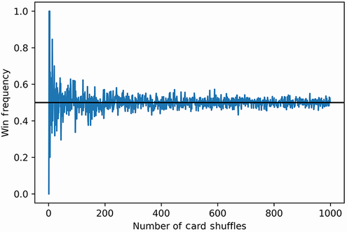
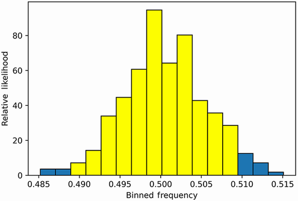
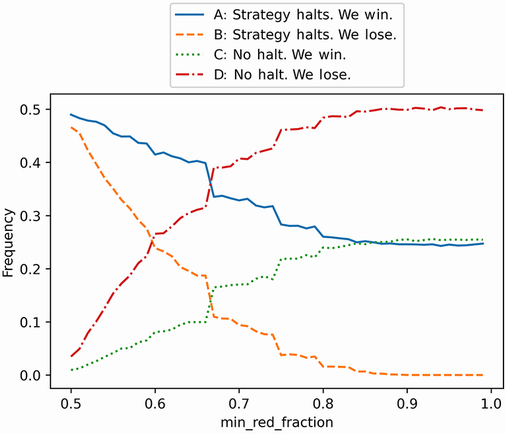

本节涵盖

- 纸牌游戏模拟
- 概率策略优化
- 置信区间

我们的目标是玩一种纸牌游戏，在这种游戏中，纸牌被反复翻转，直到我们告诉庄家停止。然后再翻转一张卡片。如果那张牌是红色的，我们就赢一美元；否则，我们将损失一美元。我们的目标是发现一种最能预测牌组中红牌的策略。我们将这样做

开发多种策略来预测随机洗牌的牌组中的红牌。
在多个模拟中应用每种策略以计算其在高置信区间内的成功概率。如果这些计算被证明是难以处理的，我们将专注于那些在 10 张卡片样本空间中表现最佳的策略。
返回与最高成功概率相关的最简单的策略。
警告 剧透警告！案例研究 1 的解决方案即将揭晓。我强烈建议你在阅读解决方案之前尝试解决问题。原始问题陈述可在案例研究开始时参考。

## 4.1 预测洗牌后的红牌

我们首先创建一个包含 26 张红牌和 26 张黑牌的牌组。黑卡用0表示，红卡用1表示。

```python
red_cards = 26 * [1]
black_cards = 26 * [0]
unshuffled_deck = red_cards + black_cards
```

我们继续洗牌。

```python
np.random.seed(1)
shuffled_deck = np.random.permutation(unshuffled_deck)
```

现在我们迭代地翻转一副牌中的牌，当下一张牌更有可能是红色时停止。然后我们翻转下一张卡片。如果那张牌是红色的，我们就赢了。

我们如何决定何时停止？一种简单的策略是当牌组中剩余的红牌数量大于牌组中剩余的黑色牌数量时终止游戏。让我们在洗牌后执行该策略。

```python
remaining_red_cards = 26
for i, card in enumerate(shuffled_deck[:-1]):
    remaining_red_cards -= card
    remaining_total_cards = 52 - i - 1                     ❶
    if remaining_red_cards / remaining_total_cards > 0.5:
        break
 
print(f"Stopping the game at index {i}.")
final_card = shuffled_deck[i + 1]
color = 'red' if final_card else 0
print(f"The next card in the deck is {'red' if final_card else 'black'}.")
print(f"We have {'won' if final_card else 'lost'}!")

Stopping the game at index 1.
The next card in the deck is red.
We have won!
```

❶ 从 52 中减去迄今为止看到的卡片总数。这个总数等于 i + 1，因为 i 最初设置为零。或者，我们可以运行 enumerate(shuffled_deck[:-1], 1) 以便 i 最初设置为 1。
该策略在我们的第一次尝试中就取得了胜利。当剩余红牌的比例大于剩余总牌数的一半时，我们的策略停止。我们可以将该分数概括为等于 min_red_fraction 参数，从而在红牌比率大于输入的参数值时停止。此通用策略接下来将 min_red_fraction 预设为 0.5 来实施。

```python
np.random.seed(0)
total_cards = 52
total_red_cards = 26
def execute_strategy(min_fraction_red=0.5, shuffled_deck=None,
                     return_index=False):
    if shuffled_deck is None:
        shuffled_deck = np.random.permutation(unshuffled_deck)               ❶
 
    remaining_red_cards = total_red_cards
 
    for i, card in enumerate(shuffled_deck[:-1]):
        remaining_red_cards -= card
        fraction_red_cards = remaining_red_cards / (total_cards - i - 1)
        if fraction_red_cards > min_fraction_red:
            break
 
    return (i+1, shuffled_deck[i+1]) if return_index else shuffled_deck[i+1] ❷
```

❶ 如果没有提供输入卡组，则将未打乱的卡组洗牌
❷ 可选地返回卡片索引和最终卡片
4.1.1 估计策略成功的概率
让我们将我们的基本策略应用于一系列 1,000 次随机洗牌。

```python
observations = np.array([execute_strategy() for _ in range(1000)])
```

观察中 1 的总分数对应于观察到的红牌分数，因此对应于获胜的分数。我们可以通过将观察中的 1 相加并除以数组大小来计算这个分数。顺便说一句，该计算也可以通过调用observations.mean() 来执行。

```python
frequency_wins = observations.sum() / 1000
assert frequency_wins == observations.mean()
print(f"The frequency of wins is {frequency_wins}")

The frequency of wins is 0.511
```

我们赢了 51.1% 的比赛！我们的策略似乎奏效了：511 胜 489 负将使我们的总利润为 22 美元。

```python
dollars_won = frequency_wins * 1000
dollars_lost = (1 - frequency_wins) * 1000
total_profit = dollars_won - dollars_lost
print(f"Total profit is ${total_profit:.2f}")

Total profit is $22.00
```

该策略适用于 1,000 次 shuffle 的样本量。我们现在绘制策略在一系列从 1 到 10,000 的样本大小上的赢频收敛（图 4.1）。



图 4.1 根据观察到的获胜次数绘制的游戏次数。频率在 0.5 的值附近波动。我们无法判断获胜的概率是高于还是低于 0.5。

```python
np.random.seed(0)
def repeat_game(number_repeats):                   ❶
    observations = np.array([execute_strategy()
                             for _ in range(number_repeats)])
    return observations.mean()
 
frequencies = []
for i in range(1, 1000):
    frequencies.append(repeat_game(i))
plt.plot(list(range(1, 1000)), frequencies)
plt.axhline(0.5, color='k')
plt.xlabel('Number of Card Shuffles')
plt.ylabel('Win-Frequency')
plt.show()
print(f"The win-frequency for 10,000 shuffles is {frequencies[-1]}")

The win-frequency for 10,000 shuffles is 0.5035035035035035
```

❶ 返回指定游戏次数的获胜频率
当采样 10,000 次洗牌时，该策略产生超过 50% 的获胜频率。然而，在整个采样过程中，该策略也在 50% 上下波动。我们对获胜概率实际上大于 0.5 的信心有多大？我们可以使用置信区间分析来找出（图 4.2）。我们通过对 10,000 次洗牌进行 300 次采样来计算置信区间，总共洗牌 300 万次。对数组进行混洗是一个计算成本很高的过程，因此清单 4.9 大约需要 40 秒才能运行。



图 4.2 300 个分箱频率的直方图，根据它们相关的相对可能性绘制。突出显示的条形描绘了 95% 的置信区间。该区间涵盖了大约 0.488-0.508 的频率范围。

```python
np.random.seed(0)
frequency_array = np.array([repeat_game(10000) for _ in range(300)])
 
likelihoods, bin_edges, patches = plt.hist(frequency_array, bins='auto',
                                           edgecolor='black', density=True)
bin_width = bin_edges[1] - bin_edges[0]
start_index, end_index = compute_high_confidence_interval(likelihoods, bin_width)                                                          ❶
 
for i in range(start_index, end_index):
     patches[i].set_facecolor('yellow')
plt.xlabel('Binned Frequency')
plt.ylabel('Relative Likelihood')
 
plt.show()

The frequency range 0.488938 - 0.509494 represents a 97.00% confidence interval
```

❶ 提醒一下，我们在第 3 节中定义了 compute_high_confidence_interval 函数。
我们非常有信心，实际概率介于 0.488 和 0.509 之间。但是，我们仍然不知道该概率是高于 0.5 还是低于 0.5。这是一个问题：即使是对真实概率的轻微误解也可能导致我们赔钱。

假设真实概率为 0.5001。如果我们将我们的策略应用于 10 亿次洗牌，我们应该期望赢得 200,000 美元。现在假设我们错了，实际概率是 0.4999。在这种情况下，我们将损失 200,000 美元。小数点后第四位的微小错误可能会使我们损失数十万美元。

我们必须绝对确定真实概率高于 0.5。因此，我们必须通过以运行时间为代价增加样本量来缩小 95% 的置信区间。以下代码在 3,000 次迭代中对 50,000 次 shuffle 进行了采样。运行大约需要一个小时。

警告 以下代码将需要一个小时才能运行。

```python
np.random.seed(0)
 
frequency_array = np.array([repeat_game(50000) for _ in range(3000)])
likelihoods, bin_edges = np.histogram(frequency_array, bins='auto',
                                      density=True)
bin_width = bin_edges[1] - bin_edges[0]
compute_high_confidence_interval(likelihoods, bin_width)

The frequency range 0.495601 - 0.504345 represents a 96.03% confidence interval
```

我们已经执行了采样。不幸的是，新的置信区间仍然无法辨别真实概率是否高于 0.5。那么我们应该怎么做呢？增加样本数量在计算上是不可行的（除非我们愿意让模拟运行几天）。也许将 min_red_fraction 从 0.5 增加到 0.75 会产生改进。让我们更新我们的策略，走很长一段路，因为我们的模拟还需要一个小时才能运行。

警告 以下代码将需要一个小时才能运行。

```python
np.random.seed(0)
def repeat_game(number_repeats, min_red_fraction):
    observations = np.array([execute_strategy(min_red_fraction)
                            for _ in range(number_repeats)])
    return observations.mean()
 
frequency_array = np.array([repeat_game(50000, 0.75) for _ in range(3000)])
likelihoods, bin_edges = np.histogram(frequency_array, bins='auto',
                                      density=True)
bin_width = bin_edges[1] - bin_edges[0]
compute_high_confidence_interval(likelihoods, bin_width)

The frequency range 0.495535 - 0.504344 represents a 96.43% confidence interval
```

不！我们的置信区间的跨度仍未解决，因为它仍然涵盖盈利和不盈利的概率。

也许我们可以通过将我们的策略应用于 10 张牌来获得更多洞察力。该套牌的样本空间可以完整地探索，从而让我们计算获胜的确切概率。

## 4.2 使用 10 张牌的样本空间优化策略

以下代码计算一副 10 张牌的样本空间。然后它将我们的基本策略应用于该样本空间。最终输出是该策略获胜的概率。

```python
total_cards = 10
total_red_cards = int(total_cards / 2)
total_black_cards = total_red_cards
unshuffled_deck = [1] * total_red_cards + [0] * total_black_cards
sample_space = set(itertools.permutations(unshuffled_deck))              ❶
win_condition = lambda x: execute_strategy(shuffled_deck=np.array(x))    ❷
prob_win = compute_event_probability(win_condition, sample_space)        ❸
print(f"Probability of a win is {prob_win}")
 
Probability of a win is 0.5
```

❶ 提醒一下，itertools 之前是在第 3 节中导入的。
❷ 我们的基本策略产生胜利的事件条件
❸ 我们在第 1 节中定义了 compute_event_probability 函数。
令人惊讶的是，我们的基本策略仅在 50% 的时间内产生胜利。这不比随机选择第一张牌好！也许我们的 min_red_fraction 参数不够低。我们可以通过对 0.50 和 1.0 之间的所有两位小数 min_red_fraction 值进行采样来找出。以下代码计算 min_red_fraction 值范围内的获胜概率，并返回最小和最大概率。

```python
def scan_strategies():
    fractions = [value / 100 for value in range(50, 100)]
    probabilities = []
    for frac in fractions:
        win_condition = lambda x: execute_strategy(frac,
                                                   shuffled_deck=np.array(x))
        probabilities.append(compute_event_probability(win_condition,
                                                       sample_space))
    return probabilities
 
probabilities = scan_strategies()
print(f"Lowest probability of win is {min(probabilities)}")
print(f"Highest probability of win is {max(probabilities)}")

Lowest probability of win is 0.5
Highest probability of win is 0.5
```

最低和最高概率都等于 0.5！我们的策略都没有优于随机卡片选择。也许调整甲板大小会产生一些改进。让我们分析包含两张、四张、六张和八张牌的套牌的样本空间。我们将所有策略应用于每个样本空间并返回它们的获胜概率。然后我们搜索不等于 0.5 的概率。

```python
for total_cards in [2, 4, 6, 8]:
    total_red_cards = int(total_cards / 2)
    total_black_cards = total_red_cards
    unshuffled_deck = [1] * total_red_cards + [0] * total_black_cards
 
    sample_space = set(itertools.permutations(unshuffled_deck))
    probabilities = scan_strategies()
    if all(prob == 0.5 for prob in probabilities):
        print(f"No winning strategy found for deck of size {total_cards}")
    else:
        print(f"Winning strategy found for deck of size {total_cards}")

No winning strategy found for deck of size 2
No winning strategy found for deck of size 4
No winning strategy found for deck of size 6
No winning strategy found for deck of size 8
```

所有策略在小甲板上产生 0.5 的概率。每次我们增加牌组大小时，我们都会向牌组中添加两张额外的牌，但这并不能提高性能。在 2 张牌上失败的策略在 4 张牌上继续失败，在 8 张牌上失败的策略在 10 张牌上继续失败。我们可以进一步推断这个逻辑。在 10 张牌组上失败的策略很可能在 12 张牌组上失败，因此在 14 张牌组和 16 张牌组上也可能失败。最终，它会在 52 张牌的甲板上失败。定性地说，这种归纳论证是有道理的。在数学上，它可以被证明是正确的。现在，我们不需要关心数学。重要的是，我们的直觉已被证明是错误的。我们的策略不适用于 10 张牌，而且我们没有理由相信它们会适用于 52 张牌。为什么这些策略会失败？

直觉上，我们最初的策略是有道理的：如果一副牌中的红牌比黑牌多，那么我们更有可能从牌中挑选一张红牌。但是，我们没有考虑红牌永远不会超过黑牌的情况。例如，假设前 26 张牌是红色的，其余的牌是黑色的。在这种情况下，我们的战略将无法停止，我们将失败。另外，让我们考虑一个洗牌的牌组，其中前 25 张牌是红色，接下来的 26 张牌是黑色，最后一张牌是红色。在这里，我们的战略不会停止，但我们仍然会赢。似乎每种策略都可能导致以下四种情况之一：

- 策略停止，下一张牌是红色的。我们赢了。
- 策略停止，下一张牌是黑色的。我们输了。
- 策略不会停止，最后一张牌是红色的。我们赢了。
- 策略不会停止，最后一张牌是黑色的。我们输了。

让我们举例说明这四种场景在 50,000 次洗牌中发生的频率。我们在两位数的 min_red_fraction 值范围内记录这些频率。然后我们根据从四种场景中观察到的发生率绘制每个 min_red_fraction 值（图 4.3）。



图 4.3 min_red_fraction 参数针对所有四种可能场景的采样频率绘制。场景 A 最初的频率大约为 0.49，但最终下降到 0.25。场景 C 的频率大约为 0.01，但最终会增加到 0.25。 A 和 C 的频率总和保持在大约 0.5，因此反映了 50% 的获胜机会。

```python
np.random.seed(0)
total_cards = 52
total_red_cards = 26
unshuffled_deck = red_cards + black_cards
 
def repeat_game_detailed(number_repeats, min_red_fraction):
 
    observations = [execute_strategy(min_red_fraction, return_index=True)
                    for _ in range(num_repeats)]                           ❶
    successes = [index for index, card, in observations if card == 1]      ❷
    halt_success = len([index for index in successes if index != 51])      ❸
    no_halt_success = len(successes) - halt_success                        ❹
 
    failures = [index for index, card, in observations if card == 0]       ❺
    halt_failure = len([index for index in failures if index != 51])       ❻
    no_halt_failure = len(failures) - halt_failure                         ❼
    result = [halt_success, halt_failure, no_halt_success, no_halt_failure]
    return [r / number_repeats for r in result]                             ❽
 
fractions = [value / 100 for value in range(50, 100)]
num_repeats = 50000
result_types = [[], [], [], []]
 
for fraction in fractions:                                                 ❾
    result = repeat_game_detailed(num_repeats, fraction)
    for i in range(4):
        result_types[i].append(result[i])
 
plt.plot(fractions, result_types[0],
         label='A) Strategy Halts. We Win.')
plt.plot(fractions, result_types[1], linestyle='--',
         label='B) Strategy Halts. We Lose.')
plt.plot(fractions, result_types[2], linestyle=':',
         label='C) No Halt. We Win.')
plt.plot(fractions, result_types[3], linestyle='-.',
         label='D) No Halt. We Lose.')
plt.xlabel('min_red_fraction')
plt.ylabel('Frequency')
plt.legend(bbox_to_anchor=(1.0, 0.5))                                      ❿
plt.show()
```

❶ 我们在 num_repeas 模拟中执行一个策略。
❷ 此列表包含所有获胜实例。
❸ 我们的策略停止而我们获胜的场景
❹ 我们的策略不会停止而我们会获胜的场景
❺ 此列表包含所有损失实例。
❻ 我们的策略停止而我们失败的场景
❼ 我们的策略不停止而我们失败的场景
❽ 我们返回所有四种场景的观察频率。
❾ 我们扫描多个策略的场景频率。
❿ bbox_to_anchor 参数用于将图例定位在图上方，以避免与绘制的四条曲线重叠。
让我们检查 min_red_fraction 值为 0.5 的图。在这里，场景 A（策略停止。我们赢了。）是最常见的结果，频率约为 0.49。同时，暂停导致大约 46% 的时间亏损（策略 B）。那么为什么我们要保持 50% 的获胜几率呢？好吧，在 1% 的情况下，我们的策略未能停止，但我们仍然获胜（场景 C）。该策略的弱点被随机机会抵消。

在图中，随着 min_red_fraction 上升，场景 A 的频率下降。我们越保守，我们就越不可能过早地停止比赛并取得胜利。同时，场景C的成功率增加。我们越保守，拿到最后一张牌并偶然获胜的可能性就越大。

随着 min_red_fraction 的增加，场景 A 和场景 C 都收敛到 0.25 的频率。因此获胜的概率保持在 50%。有时我们的策略会停止，但我们确实赢了。其他时候，策略停止，我们仍然失败。每个策略提供的任何优势都会被这些损失自动抵消。然而，我们偶尔会走运：我们的策略没有停止，但我们赢得了比赛。这些幸运的胜利弥补了我们的损失，我们获胜的概率保持不变。无论我们做什么，我们获胜的可能性仍然是五五十。因此，我们可以提供的最佳策略是选择洗好的牌组中的第一张牌。

```python
def optimal_strategy(shuffled_deck):
    return shuffled_deck[0]
```

## 概括

- 概率可能是违反直觉的。天生地，我们假设我们计划的纸牌游戏策略会比随机策略表现得更好。然而，事实证明并非如此。我们在处理随机过程时必须小心。在对任何未来结果下注之前，最好严格测试我们所有的直觉假设。
- 有时，即使是大规模模拟也无法在所需的精度水平内找到概率。然而，通过简化我们的问题，我们可以利用样本空间来产生见解。样本空间允许我们测试我们的直觉。如果我们的直观解决方案在问题的玩具版本上失败，它也可能在问题的实际版本上失败。