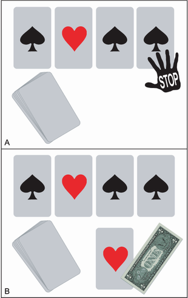

## 问题陈述
你想赢点钱吗？让我们在纸牌游戏上赌小赌注。在你面前是一副洗牌的纸牌。所有 52 张牌都面朝下。一半的牌是红色的，一半是黑色的。我将继续一张一张地翻转卡片。如果我翻转的最后一张牌是红色的，你将赢得一美元。否则，您将损失一美元。

这是转折点：您可以随时要求我停止游戏。一旦你说“暂停”，我就会翻转下一张牌并结束游戏。下一张牌将作为最后一张牌。如果它是红色的，您将赢得一美元，如图 CS1.1 所示。

图 CS1.1 翻牌游戏。我们从洗牌的牌组开始。我反复翻转甲板上的最上面的牌。 (A) 我刚刚翻出了第四张牌。你让我停下来。 (B) 我翻转第五张也是最后一张牌。最后一张牌是红色的。你赢了一美元。

我们可以根据您的喜好多次玩游戏。牌组每次都会重新洗牌。每一轮结束后，我们都会换钱。您赢得这场比赛的最佳方法是什么？

## 概述

为了解决手头的问题，我们需要知道如何

1. 使用样本空间分析计算可观察事件的概率。
2. 绘制一系列区间值的事件概率。
3. 使用 Python 模拟随机过程，例如掷硬币和洗牌。
4. 使用置信区间分析评估我们对模拟决策的信心。